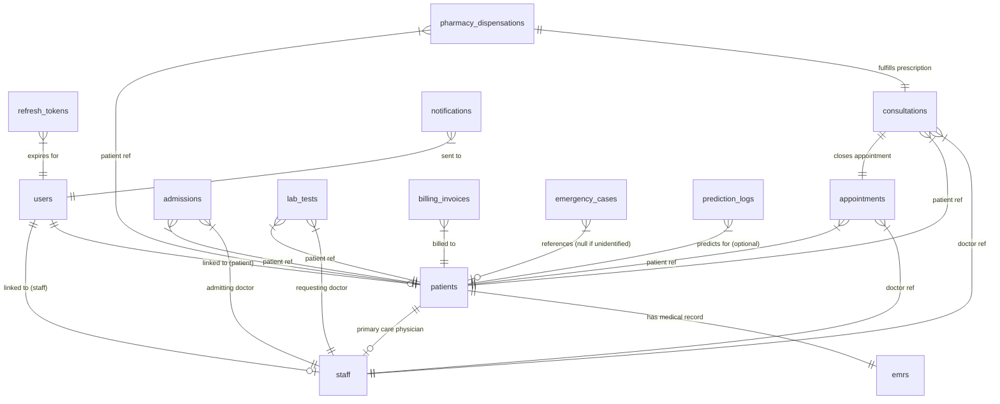

# AI-Powered Hospital & Healthcare Management System (HMS)
## MongoDB Database Design Document

This document defines the complete MongoDB database architecture for the AI-Powered Hospital & Healthcare Management System. It details the collection schemas, relationship strategies, indexing rules, Spring Data MongoDB configurations, and scalability designs across all modules.

---

## 1. Architectural Design Principles

MongoDB is a document-oriented database. Unlike traditional relational databases (RDBMS), its primary design goal is **reducing read latency** and **supporting horizontal scaling** through denormalization, embedding, and flexible schemas. 

For this Spring Boot-based healthcare application, our design enforces the following best practices:
1. **Prefer Embedding for Bounded Relationships**: 1-to-1 or 1-to-many relationships where the child data is uniquely owned by the parent and does not grow infinitely (e.g., vital signs in a consultation, invoice line items, patient emergency contacts) are embedded as subdocuments.
2. **Prefer Referencing for Unbounded Relationships & Shared Entities**: 1-to-many relationships that grow continuously (e.g., appointments for a patient, lab tests) are referenced using ObjectIds. We represent this in Spring Data MongoDB using manual references (e.g., `ObjectId patientId`) or lazy-loaded `@DocumentReference`.
3. **Design for Document Boundaries**: MongoDB documents have a hard limit of 16MB. We design arrays such that they are naturally bounded (e.g., daily rounds in an admission, which are bounded by the length of stay, or batch records for a specific medicine).
4. **AI-Ready Schema**: The schema natively accommodates machine learning features such as risk assessment profiles, no-show probabilities, triage suggestion scores, and drug-interaction warning details.

---

## 2. Collection Relationship Diagram

The following Mermaid diagram outlines the entity relationships, highlighting how collections link together. Note that references are marked as lines, whereas subdocument embedding is represented internally within collections.



---

## 3. Detailed Collection Specifications

We define **14 Collections** mapped across the 12 requested modules, plus system analytics and tokens.

---

### Module 1: Authentication & Authorization

This module manages system login, role-based access control (RBAC), multi-factor authentication (MFA), and session management.

#### Collection 1: `users`
* **Strategy**: Referenced. Contains critical authorization elements and credentials. Points to either the `patients` or `staff` collection via `linkedEntityId`.
* **Spring Data Annotations**: `@Document(collection = "users")`, `@Indexed(unique = true)` on username/email.

##### Field Definitions:
| Field Name | Spring Data Type | BSON Type | Required | Description / Constraint |
| :--- | :--- | :--- | :--- | :--- |
| `_id` | `org.bson.types.ObjectId` | `ObjectId` | Yes | Primary key. |
| `username` | `java.lang.String` | `string` | Yes | Unique login identifier. |
| `passwordHash` | `java.lang.String` | `string` | Yes | BCrypt password hash. |
| `email` | `java.lang.String` | `string` | Yes | Unique contact email. |
| `roles` | `java.util.List<String>` | `array[string]` | Yes | Roles (e.g., `ROLE_PATIENT`, `ROLE_DOCTOR`, `ROLE_ADMIN`). |
| `permissions` | `java.util.List<String>` | `array[string]` | Yes | Granular permissions (e.g., `READ_EMR`, `WRITE_PRESCRIPTION`). |
| `status` | `java.lang.String` | `string` | Yes | Enum: `ACTIVE`, `INACTIVE`, `SUSPENDED`, `LOCKED`. |
| `mfaEnabled` | `boolean` | `bool` | Yes | Multi-factor auth flag. |
| `mfaSecret` | `java.lang.String` | `string` | No | Secret key for TOTP/Google Authenticator. |
| `linkedEntityId` | `org.bson.types.ObjectId` | `objectId` | Yes | Reference to target profile document in `patients` or `staff`. |
| `linkedEntityType`| `java.lang.String` | `string` | Yes | Enum: `PATIENT`, `STAFF` to resolve reference collection. |
| `createdAt` | `java.time.Instant` | `date` | Yes | Audit field (Spring `@CreatedDate`). |
| `updatedAt` | `java.time.Instant` | `date` | Yes | Audit field (Spring `@LastModifiedDate`). |

##### Indexing Strategy:
1. `{"username": 1}`: Unique index for login validation.
2. `{"email": 1}`: Unique index for lookup and registration checks.
3. `{"linkedEntityId": 1}`: Secondary index for finding user credentials by entity.

##### Sample JSON Document:
```json
{
  "_id": {"$oid": "60b8d29a1f28b4382c8f8e01"},
  "username": "dr.smith",
  "passwordHash": "$2a$10$eFytJDGtjbThWa8V98.ZPeo48R0.k26B1y27KDu92a9xJtXF6ZfEq",
  "email": "john.smith@hospital.com",
  "roles": ["ROLE_DOCTOR", "ROLE_CONSULTANT"],
  "permissions": ["READ_EMR", "WRITE_PRESCRIPTION", "SCHEDULE_APPOINTMENT"],
  "status": "ACTIVE",
  "mfaEnabled": true,
  "mfaSecret": "ORSXG5BRGIZTINJWG4======",
  "linkedEntityId": {"$oid": "60b8d29a1f28b4382c8f8e02"},
  "linkedEntityType": "STAFF",
  "createdAt": {"$date": "2026-06-12T08:00:00Z"},
  "updatedAt": {"$date": "2026-06-12T08:00:00Z"}
}
```

##### Spring Data MongoDB Model Code:
```java
package com.hms.backend.model.auth;

import lombok.Data;
import org.bson.types.ObjectId;
import org.springframework.data.annotation.*;
import org.springframework.data.mongodb.core.index.Indexed;
import org.springframework.data.mongodb.core.mapping.Document;
import org.springframework.data.mongodb.core.mapping.Field;
import java.time.Instant;
import java.util.List;

@Data
@Document(collection = "users")
public class User {
    @Id
    private ObjectId id;

    @Indexed(unique = true)
    private String username;

    @Field("password_hash")
    private String passwordHash;

    @Indexed(unique = true)
    private String email;

    private List<String> roles;
    private List<String> permissions;
    private String status;

    @Field("mfa_enabled")
    private boolean mfaEnabled;

    @Field("mfa_secret")
    private String mfaSecret;

    @Field("linked_entity_id")
    private ObjectId linkedEntityId;

    @Field("linked_entity_type")
    private String linkedEntityType;

    @CreatedDate
    private Instant createdAt;

    @LastModifiedDate
    private Instant updatedAt;
}
```

---

#### Collection 2: `refresh_tokens`
* **Strategy**: Referenced. Ephemeral session records designed to be auto-removed when expired.
* **Spring Data Annotations**: `@Document(collection = "refresh_tokens")`, `@Indexed(expireAfterSeconds = 0)` for TTL.

##### Field Definitions:
| Field Name | Spring Data Type | BSON Type | Required | Description / Constraint |
| :--- | :--- | :--- | :--- | :--- |
| `_id` | `org.bson.types.ObjectId` | `ObjectId` | Yes | Primary key. |
| `userId` | `org.bson.types.ObjectId` | `objectId` | Yes | Reference to the `users` document. |
| `token` | `java.lang.String` | `string` | Yes | Unique Cryptographic Token string. |
| `expiryDate` | `java.time.Instant` | `date` | Yes | Expire timestamp. Used for TTL. |
| `revoked` | `boolean` | `bool` | Yes | Flag for blacklisting tokens before actual expiry. |

##### Indexing Strategy:
1. `{"token": 1}`: Unique index for verification lookup.
2. `{"expiryDate": 1}`: TTL Index. Mongo background process checks this periodically and drops documents when the current time is past `expiryDate`.

##### Sample JSON Document:
```json
{
  "_id": {"$oid": "60b8d29a1f28b4382c8f8e03"},
  "userId": {"$oid": "60b8d29a1f28b4382c8f8e01"},
  "token": "d748f321-4f11-482a-bc91-2337d1d2b7ac",
  "expiryDate": {"$date": "2026-06-19T08:00:00Z"},
  "revoked": false
}
```

---

### Module 2: Patient Management & Staff Management

This module houses patient demography, clinical identifiers, contacts, insurance carriers, and primary doctors. It also tracks hospital employees (physicians, nurses, technicians).

#### Collection 3: `patients`
* **Strategy**: Mixed. Core details are embedded (e.g., demographics, address, emergency contacts, insurance policies), while medical encounters are referenced to prevent infinite document growth. Includes an AI-generated health risk profile.
* **Spring Data Annotations**: `@Document(collection = "patients")`, `@Indexed(unique = true)` on `patientId`.

##### Field Definitions:
| Field Name | Spring Data Type | BSON Type | Required | Description / Constraint |
| :--- | :--- | :--- | :--- | :--- |
| `_id` | `org.bson.types.ObjectId` | `ObjectId` | Yes | Primary key. |
| `patientId` | `java.lang.String` | `string` | Yes | Human-readable business key (e.g., `PAT-2026-09412`). |
| `personalInfo` | `PatientInfo` (Subdoc) | `document` | Yes | Contains firstName, lastName, dateOfBirth, gender, bloodGroup. |
| `contactInfo` | `ContactInfo` (Subdoc) | `document` | Yes | Contains email, phone, and embedded address details. |
| `emergencyContacts`| `List<EmergencyContact>` | `array[doc]` | Yes | Embedded list of emergency relations (bounded: 1-3 entries). |
| `insuranceDetails` | `List<InsuranceDetail>` | `array[doc]` | No | Embedded list of insurance policies. |
| `primaryDoctorId` | `org.bson.types.ObjectId`| `objectId` | No | Referenced doctor in `staff` collection. |
| `aiHealthProfile` | `AIHealthProfile` (Subdoc) | `document` | No | AI scoring: cardiac risk, diabetes risk, readmission risk. |
| `createdAt` | `java.time.Instant` | `date` | Yes | Audit creation time. |
| `updatedAt` | `java.time.Instant` | `date` | Yes | Audit modification time. |

##### Indexing Strategy:
1. `{"patientId": 1}`: Unique index for fast Patient ID queries.
2. `{"personalInfo.lastName": 1, "personalInfo.firstName": 1}`: Compound index for search filters.
3. `{"contactInfo.phone": 1}`: Unique-index equivalent or simple index for lookups.
4. `{"aiHealthProfile.readmissionRiskScore": -1}`: Index to allow quick extraction of high-risk patients for AI clinical interventions.

##### Sample JSON Document:
```json
{
  "_id": {"$oid": "60b8d29a1f28b4382c8f8e04"},
  "patientId": "PAT-2026-1024",
  "personalInfo": {
    "firstName": "Robert",
    "lastName": "Chen",
    "dateOfBirth": {"$date": "1984-11-23T00:00:00Z"},
    "gender": "MALE",
    "bloodGroup": "O_POSITIVE"
  },
  "contactInfo": {
    "email": "robert.chen@email.com",
    "phone": "+1-555-0199",
    "address": {
      "street": "142 Maple Drive",
      "city": "Boston",
      "state": "MA",
      "postalCode": "02115",
      "country": "USA"
    }
  },
  "emergencyContacts": [
    {
      "name": "Linda Chen",
      "relationship": "SPOUSE",
      "phone": "+1-555-0198"
    }
  ],
  "insuranceDetails": [
    {
      "provider": "BlueShield Co",
      "policyNumber": "BS-991823-A",
      "groupNumber": "GR-8899",
      "coverageDetails": "Standard Inpatient & Outpatient Care",
      "expiryDate": {"$date": "2027-12-31T00:00:00Z"}
    }
  ],
  "primaryDoctorId": {"$oid": "60b8d29a1f28b4382c8f8e02"},
  "aiHealthProfile": {
    "cardiacRiskScore": 0.12,
    "diabetesRiskScore": 0.68,
    "readmissionRiskScore": 0.45,
    "lastAnalyzedAt": {"$date": "2026-06-12T10:00:00Z"}
  },
  "createdAt": {"$date": "2026-06-01T09:00:00Z"},
  "updatedAt": {"$date": "2026-06-12T10:00:00Z"}
}
```

---

#### Collection 4: `staff`
* **Strategy**: Referenced. Holds profiles of all hospital personnel, including department allocation, shifts, and medical specializations.
* **Spring Data Annotations**: `@Document(collection = "staff")`, `@Indexed(unique = true)` on `employeeId`.

##### Field Definitions:
| Field Name | Spring Data Type | BSON Type | Required | Description / Constraint |
| :--- | :--- | :--- | :--- | :--- |
| `_id` | `org.bson.types.ObjectId` | `ObjectId` | Yes | Primary key. |
| `employeeId` | `java.lang.String` | `string` | Yes | Employee ID card number (e.g. `STF-9988`). |
| `firstName` | `java.lang.String` | `string` | Yes | Staff first name. |
| `lastName` | `java.lang.String` | `string` | Yes | Staff last name. |
| `department` | `java.lang.String` | `string` | Yes | Working department (e.g., `CARDIOLOGY`, `PEDIATRICS`, `PHARMACY`). |
| `specialization` | `java.lang.String` | `string` | No | Medical specialty (mainly for doctors). |
| `email` | `java.lang.String` | `string` | Yes | Unique official email. |
| `phone` | `java.lang.String` | `string` | Yes | Emergency contact number. |
| `activeStatus` | `boolean` | `bool` | Yes | Current employment status. |
| `scheduleSlots` | `List<DaySchedule>` (Subdoc)| `array[doc]` | No | Available hours per day of the week. |

##### Indexing Strategy:
1. `{"employeeId": 1}`: Unique index.
2. `{"department": 1, "specialization": 1}`: Compound index for matching doctors to incoming appointments.

---

### Module 3: Appointment Management

Maintains schedule slots, booking status, patient-doctor pairs, and AI no-show prediction analytics.

#### Collection 5: `appointments`
* **Strategy**: Referenced. Contains independent transactional records mapping patients to staff for a specific time. Employs AI predictions to assess the risk of a no-show.
* **Spring Data Annotations**: `@Document(collection = "appointments")`.

##### Field Definitions:
| Field Name | Spring Data Type | BSON Type | Required | Description / Constraint |
| :--- | :--- | :--- | :--- | :--- |
| `_id` | `org.bson.types.ObjectId` | `ObjectId` | Yes | Primary key. |
| `appointmentId` | `java.lang.String` | `string` | Yes | Unique ID (e.g. `APP-2026-9088`). |
| `patientId` | `org.bson.types.ObjectId` | `objectId` | Yes | Referenced patient in `patients`. |
| `doctorId` | `org.bson.types.ObjectId` | `objectId` | Yes | Referenced doctor in `staff`. |
| `dateTime` | `java.time.Instant` | `date` | Yes | Scheduled start time. |
| `status` | `java.lang.String` | `string` | Yes | Enum: `SCHEDULED`, `COMPLETED`, `CANCELLED`, `NO_SHOW`. |
| `reasonForVisit` | `java.lang.String` | `string` | Yes | Free text reason. |
| `department` | `java.lang.String` | `string` | Yes | Target department. |
| `bookingChannel` | `java.lang.String` | `string` | Yes | Enum: `MOBILE_APP`, `WEB_PORTAL`, `WALK_IN`, `CALL_CENTER`. |
| `cancellationReason`| `java.lang.String`| `string` | No | Filled if status is `CANCELLED`. |
| `aiNoShowPrediction`| `NoShowPrediction` (Subdoc)| `document` | No | AI output: probability, risk category (LOW/MED/HIGH). |
| `createdAt` | `java.time.Instant` | `date` | Yes | Audit field. |
| `updatedAt` | `java.time.Instant` | `date` | Yes | Audit field. |

##### Indexing Strategy:
1. `{"doctorId": 1, "dateTime": 1}`: Compound index. Critical to prevent double-booking slot conflicts.
2. `{"patientId": 1, "dateTime": -1}`: Compound index to fetch a patient's historical appointment timeline in descending order.
3. `{"status": 1, "dateTime": 1}`: Index to process pending appointments and check for automatic updates.

##### Sample JSON Document:
```json
{
  "_id": {"$oid": "60b8d29a1f28b4382c8f8e05"},
  "appointmentId": "APP-2026-0099",
  "patientId": {"$oid": "60b8d29a1f28b4382c8f8e04"},
  "doctorId": {"$oid": "60b8d29a1f28b4382c8f8e02"},
  "dateTime": {"$date": "2026-06-15T09:30:00Z"},
  "status": "SCHEDULED",
  "reasonForVisit": "Follow-up on high blood pressure",
  "department": "CARDIOLOGY",
  "bookingChannel": "MOBILE_APP",
  "aiNoShowPrediction": {
    "noShowProbability": 0.18,
    "riskFactor": "LOW",
    "predictedAt": {"$date": "2026-06-12T11:00:00Z"}
  },
  "createdAt": {"$date": "2026-06-12T11:00:00Z"},
  "updatedAt": {"$date": "2026-06-12T11:00:00Z"}
}
```

##### Spring Data MongoDB Model Code:
```java
package com.hms.backend.model.appointment;

import lombok.Data;
import org.bson.types.ObjectId;
import org.springframework.data.annotation.*;
import org.springframework.data.mongodb.core.index.CompoundIndex;
import org.springframework.data.mongodb.core.index.CompoundIndexes;
import org.springframework.data.mongodb.core.mapping.Document;
import org.springframework.data.mongodb.core.mapping.Field;
import java.time.Instant;

@Data
@Document(collection = "appointments")
@CompoundIndexes({
    @CompoundIndex(name = "doctor_schedule_idx", def = "{'doctorId': 1, 'dateTime': 1}", unique = true),
    @CompoundIndex(name = "patient_timeline_idx", def = "{'patientId': 1, 'dateTime': -1}")
})
public class Appointment {
    @Id
    private ObjectId id;

    @Field("appointment_id")
    private String appointmentId;

    @Field("patient_id")
    private ObjectId patientId;

    @Field("doctor_id")
    private ObjectId doctorId;

    @Field("date_time")
    private Instant dateTime;

    private String status;

    @Field("reason_for_visit")
    private String reasonForVisit;

    private String department;

    @Field("booking_channel")
    private String bookingChannel;

    @Field("cancellation_reason")
    private String cancellationReason;

    @Field("ai_noshow_prediction")
    private NoShowPrediction aiNoShowPrediction;

    @CreatedDate
    private Instant createdAt;

    @LastModifiedDate
    private Instant updatedAt;

    @Data
    public static class NoShowPrediction {
        private double noShowProbability;
        private String riskFactor;
        private Instant predictedAt;
    }
}
```

---

### Module 4: Doctor Consultation

Records physical parameters, symptoms, ICD-10 diagnoses, and prescription orders filled during a clinic visit.

#### Collection 6: `consultations`
* **Strategy**: Mixed. Highly optimized for query efficiency. The consultation is a reference mapping (Patient, Doctor, Appointment), but it embeds the physical `vitals`, the `diagnoses` array, and the complete list of medications (which are bounded and immutable once finalized). Also stores AI-generated diagnostic recommendations and drug interaction evaluations.
* **Spring Data Annotations**: `@Document(collection = "consultations")`.

##### Field Definitions:
| Field Name | Spring Data Type | BSON Type | Required | Description / Constraint |
| :--- | :--- | :--- | :--- | :--- |
| `_id` | `org.bson.types.ObjectId` | `ObjectId` | Yes | Primary key. |
| `consultationId` | `java.lang.String` | `string` | Yes | Unique ID (e.g. `CNS-2026-1209`). |
| `appointmentId` | `org.bson.types.ObjectId` | `objectId` | Yes | Referenced appointment. |
| `patientId` | `org.bson.types.ObjectId` | `objectId` | Yes | Referenced patient. |
| `doctorId` | `org.bson.types.ObjectId` | `objectId` | Yes | Referenced doctor. |
| `vitals` | `Vitals` (Subdoc) | `document` | Yes | BP, HeartRate, Temperature, SpO2, weight, height. |
| `symptoms` | `List<String>` | `array[string]`| Yes | List of symptoms reported. |
| `clinicalNotes` | `java.lang.String` | `string` | Yes | Consultation notes text. |
| `diagnoses` | `List<Diagnosis>` (Subdoc)| `array[doc]` | Yes | ICD-10 code subdocuments. |
| `prescription` | `Prescription` (Subdoc) | `document` | No | Embedded medications lists. |
| `followUpDate` | `java.time.Instant` | `date` | No | Optional follow-up date. |
| `aiClinicalInsights`| `AIInsights` (Subdoc) | `document` | No | Suggested diagnoses, drug interactions. |
| `createdAt` | `java.time.Instant` | `date` | Yes | Audit field. |

##### Indexing Strategy:
1. `{"patientId": 1, "createdAt": -1}`: Compound index. Fetch recent patient visits.
2. `{"doctorId": 1, "createdAt": -1}`: Doctor history index.
3. Text Index: `{"clinicalNotes": "text", "symptoms": "text"}`: Allows search over medical text narratives.

##### Sample JSON Document:
```json
{
  "_id": {"$oid": "60b8d29a1f28b4382c8f8e06"},
  "consultationId": "CNS-2026-7890",
  "appointmentId": {"$oid": "60b8d29a1f28b4382c8f8e05"},
  "patientId": {"$oid": "60b8d29a1f28b4382c8f8e04"},
  "doctorId": {"$oid": "60b8d29a1f28b4382c8f8e02"},
  "vitals": {
    "bloodPressure": "135/88",
    "heartRate": 82,
    "temperature": 37.1,
    "spo2": 98,
    "weight": 78.5,
    "height": 175.0
  },
  "symptoms": ["chronic cough", "mild fever"],
  "clinicalNotes": "Patient has persistent dry cough. Lungs clear to auscultation. No cardiac murmur.",
  "diagnoses": [
    {
      "icdCode": "J06.9",
      "description": "Acute upper respiratory infection, unspecified",
      "type": "PRIMARY"
    }
  ],
  "prescription": {
    "prescriptionId": "PR-99881",
    "medications": [
      {
        "medicineId": {"$oid": "60b8d29a1f28b4382c8f8e0b"},
        "medicineName": "Amoxicillin 500mg",
        "dosage": "500mg",
        "frequency": "Three times daily",
        "duration": "7 days",
        "instructions": "Take with food"
      }
    ]
  },
  "aiClinicalInsights": {
    "suggestedDiagnoses": ["Bronchitis", "Upper Respiratory Tract Infection"],
    "drugInteractionsDetected": ["No severe interaction warnings matching current prescription history."],
    "clinicalSummary": "Suspected acute bronchitis. Rx: Amoxicillin."
  },
  "createdAt": {"$date": "2026-06-15T10:00:00Z"}
}
```

---

### Module 5: Electronic Medical Records (EMR)

Tracks general allergies, chronic conditions, family medical history, and surgeries. Serves as the centralized index of a patient's historical medical profile.

#### Collection 7: `emrs`
* **Strategy**: Referenced to Patient, but maintains all persistent profiles embedded internally. We enforce a **1-to-1 relationship** between `patients` and `emrs`. This single document acts as the aggregate record. Since allergies, surgeries, and family histories are bounded (rarely exceeding ~100 elements), they fit comfortably in one document. Includes NLP-generated clinical summaries.
* **Spring Data Annotations**: `@Document(collection = "emrs")`, `@Indexed(unique = true)` on `patientId`.

##### Field Definitions:
| Field Name | Spring Data Type | BSON Type | Required | Description / Constraint |
| :--- | :--- | :--- | :--- | :--- |
| `_id` | `org.bson.types.ObjectId` | `ObjectId` | Yes | Primary key. |
| `patientId` | `org.bson.types.ObjectId` | `objectId` | Yes | Unique reference back to the patient. |
| `allergies` | `List<Allergy>` (Subdoc) | `array[doc]` | Yes | List of active allergies. |
| `chronicConditions`| `List<ChronicCondition>` | `array[doc]` | Yes | Ongoing conditions (e.g. Asthma, Diabetes). |
| `surgeries` | `List<Surgery>` (Subdoc) | `array[doc]` | Yes | Historical surgeries. |
| `familyHistory` | `List<FamilyHistory>` | `array[doc]` | Yes | Hereditary conditions. |
| `socialHistory` | `SocialHistory` (Subdoc) | `document` | Yes | Smoking, alcohol intake, physical activity. |
| `aiMedicalSummary` | `java.lang.String` | `string` | No | AI LLM generated executive summary of health. |
| `updatedAt` | `java.time.Instant` | `date` | Yes | Last modifications date. |

##### Indexing Strategy:
1. `{"patientId": 1}`: Unique index for 1-to-1 patient mapping.
2. Text index on embedded fields: `{"allergies.allergen": "text", "chronicConditions.condition": "text"}` for immediate access to historical medical profiles during emergencies.

##### Sample JSON Document:
```json
{
  "_id": {"$oid": "60b8d29a1f28b4382c8f8e07"},
  "patientId": {"$oid": "60b8d29a1f28b4382c8f8e04"},
  "allergies": [
    {
      "allergen": "Penicillin",
      "severity": "SEVERE",
      "reaction": "Anaphylaxis"
    }
  ],
  "chronicConditions": [
    {
      "condition": "Type 2 Diabetes Mellitus",
      "diagnosedDate": {"$date": "2021-04-12T00:00:00Z"},
      "status": "ACTIVE"
    }
  ],
  "surgeries": [
    {
      "procedure": "Appendectomy",
      "date": {"$date": "2015-08-20T00:00:00Z"},
      "notes": "Laparoscopic surgery, no complications."
    }
  ],
  "familyHistory": [
    {
      "relation": "FATHER",
      "condition": "Hypertension"
    }
  ],
  "socialHistory": {
    "smoking": "NEVER",
    "alcohol": "SOCIAL",
    "dietaryHabits": "High-carb diet, desk job"
  },
  "aiMedicalSummary": "Patient is a 41-year-old male with a history of Type 2 Diabetes diagnosed in 2021. Known anaphylactic reaction to Penicillin. Underwent uncomplicated laparoscopic appendectomy in 2015. Family history positive for paternal hypertension.",
  "updatedAt": {"$date": "2026-06-12T10:05:00Z"}
}
```

---

### Module 6: Laboratory Management

Coordinates laboratory tests ordered, specimens collected, test parameters, and binary reports.

#### Collection 8: `lab_tests`
* **Strategy**: Referenced. Lab tests are generated continuously, and their parameter values are unique to each specific order. We embed test results parameters (bounded and small) and reference the patient, requesting physician, and lab technician. Large files (like MRI/X-ray PDFs) are referenced via external S3/GridFS links.
* **Spring Data Annotations**: `@Document(collection = "lab_tests")`.

##### Field Definitions:
| Field Name | Spring Data Type | BSON Type | Required | Description / Constraint |
| :--- | :--- | :--- | :--- | :--- |
| `_id` | `org.bson.types.ObjectId` | `ObjectId` | Yes | Primary key. |
| `testId` | `java.lang.String` | `string` | Yes | Business key (e.g. `LAB-2026-9092`). |
| `patientId` | `org.bson.types.ObjectId` | `objectId` | Yes | Referenced patient. |
| `requestingDoctorId`| `org.bson.types.ObjectId`| `objectId` | Yes | Physician who ordered the test. |
| `testType` | `java.lang.String` | `string` | Yes | Code/Type (e.g., `CBC`, `METABOLIC_PANEL`). |
| `status` | `java.lang.String` | `string` | Yes | Enum: `ORDERED`, `COLLECTED`, `PROCESSING`, `COMPLETED`, `CANCELLED`. |
| `orderedDate` | `java.time.Instant` | `date` | Yes | Order stamp. |
| `collectedDate` | `java.time.Instant` | `date` | No | Specimen draw timestamp. |
| `completedDate` | `java.time.Instant` | `date` | No | Result release timestamp. |
| `specimenType` | `java.lang.String` | `string` | Yes | e.g. `BLOOD`, `URINE`, `CSF`. |
| `technicianId` | `org.bson.types.ObjectId` | `objectId` | No | Lab staff processing the test. |
| `results` | `List<LabResult>` (Subdoc) | `array[doc]` | No | Parameter readings, reference ranges, and flags. |
| `attachments` | `List<String>` | `array[string]`| No | Links to raw files (GridFS / S3). |
| `aiAnomalyDetection`| `LabAnomaly` (Subdoc) | `document` | No | AI flagging for critical outlier spikes. |
| `createdAt` | `java.time.Instant` | `date` | Yes | Audit field. |

##### Indexing Strategy:
1. `{"patientId": 1, "status": 1}`: Index to trace active pending laboratory orders for a patient.
2. `{"status": 1, "orderedDate": 1}`: Tech dashboard index.
3. `{"aiAnomalyDetection.criticalFlag": 1}`: Index for instant medical alert routing of life-threatening anomalies.

##### Sample JSON Document:
```json
{
  "_id": {"$oid": "60b8d29a1f28b4382c8f8e08"},
  "testId": "LAB-2026-5544",
  "patientId": {"$oid": "60b8d29a1f28b4382c8f8e04"},
  "requestingDoctorId": {"$oid": "60b8d29a1f28b4382c8f8e02"},
  "testType": "HbA1c Blood Test",
  "status": "COMPLETED",
  "orderedDate": {"$date": "2026-06-12T08:00:00Z"},
  "collectedDate": {"$date": "2026-06-12T08:30:00Z"},
  "completedDate": {"$date": "2026-06-12T11:30:00Z"},
  "specimenType": "BLOOD",
  "technicianId": {"$oid": "60b8d29a1f28b4382c8f8e09"},
  "results": [
    {
      "parameterName": "Hemoglobin A1c",
      "value": "7.2",
      "unit": "%",
      "referenceRange": "4.0 - 5.6",
      "status": "HIGH"
    }
  ],
  "attachments": [
    "https://hms-reports-s3.s3.amazonaws.com/2026/labs/LAB-5544.pdf"
  ],
  "aiAnomalyDetection": {
    "anomalyDetected": true,
    "anomalyDetails": "HbA1c levels confirm poor glycemic control (above 7.0%). Risk of diabetic complications.",
    "criticalFlag": false,
    "confidenceScore": 0.98
  },
  "createdAt": {"$date": "2026-06-12T08:00:00Z"}
}
```

---

### Module 7: Pharmacy Management

Manages catalog inventory, active supplier batches, expiration dates, and pharmacy dispensations.

#### Collection 9: `pharmacy_inventory`
* **Strategy**: Mixed. An inventory item corresponds to a single drug catalog entry. To avoid separate joins, drug information is contained within the document, while its physical batches are embedded as a bounded array. Batch array sizes are naturally restricted since expired batches are archived and removed. Includes demand forecasts.
* **Spring Data Annotations**: `@Document(collection = "pharmacy_inventory")`, `@Indexed(unique = true)` on `medicineId`.

##### Field Definitions:
| Field Name | Spring Data Type | BSON Type | Required | Description / Constraint |
| :--- | :--- | :--- | :--- | :--- |
| `_id` | `org.bson.types.ObjectId` | `ObjectId` | Yes | Primary key. |
| `medicineId` | `java.lang.String` | `string` | Yes | Unique catalog reference (e.g. `MED-1102`). |
| `name` | `java.lang.String` | `string` | Yes | Brand name (e.g., `Amoxil`). |
| `genericName` | `java.lang.String` | `string` | Yes | Active compound (e.g., `Amoxicillin`). |
| `category` | `java.lang.String` | `string` | Yes | e.g. `ANTIBIOTIC`, `CARDIOVASCULAR`. |
| `dosageForm` | `java.lang.String` | `string` | Yes | e.g. `TABLET`, `CAPSULE`, `LIQUID`. |
| `totalStock` | `int` | `int` | Yes | Aggregated stock level from all batches. |
| `reorderLevel` | `int` | `int` | Yes | Trigger point for restocking alerts. |
| `pricePerUnit` | `double` | `double` | Yes | Sale price per unit. |
| `batches` | `List<Batch>` (Subdoc) | `array[doc]` | Yes | Embedded list of active physical batches. |
| `aiInventoryForecasting`| `AIInventory` (Subdoc) | `document` | No | Reorder suggestions based on demand models. |
| `createdAt` | `java.time.Instant` | `date` | Yes | Audit field. |
| `updatedAt` | `java.time.Instant` | `date` | Yes | Audit field. |

##### Indexing Strategy:
1. `{"medicineId": 1}`: Unique index.
2. `{"name": 1}`: Index for search auto-completion.
3. `{"batches.expiryDate": 1}`: Index to scan for expired batches.
4. `{"totalStock": 1}`: Index for stock count monitoring.

##### Sample JSON Document:
```json
{
  "_id": {"$oid": "60b8d29a1f28b4382c8f8e0b"},
  "medicineId": "MED-1102",
  "name": "Amoxicillin 500mg",
  "genericName": "Amoxicillin",
  "category": "ANTIBIOTIC",
  "dosageForm": "CAPSULE",
  "totalStock": 1200,
  "reorderLevel": 500,
  "pricePerUnit": 0.45,
  "batches": [
    {
      "batchNumber": "BAT-AMX-001",
      "quantity": 1200,
      "expiryDate": {"$date": "2027-10-31T23:59:59Z"},
      "manufactureDate": {"$date": "2025-10-01T00:00:00Z"},
      "supplierName": "PharmaCorp Ltd"
    }
  ],
  "aiInventoryForecasting": {
    "predictedDemandNextMonth": 1500,
    "recommendedReorderQty": 1000,
    "runoutRiskDays": 24,
    "lastPredictedAt": {"$date": "2026-06-12T12:00:00Z"}
  },
  "createdAt": {"$date": "2026-06-01T08:00:00Z"},
  "updatedAt": {"$date": "2026-06-12T12:00:00Z"}
}
```

---

#### Collection 10: `pharmacy_dispensations`
* **Strategy**: Referenced. Maps checkout transactions. Links to patient, pharmacist, and prescription source (`consultations`). Dispensed medication items (amounts, pricing snapshot) are embedded as subdocuments.
* **Spring Data Annotations**: `@Document(collection = "pharmacy_dispensations")`.

##### Field Definitions:
| Field Name | Spring Data Type | BSON Type | Required | Description / Constraint |
| :--- | :--- | :--- | :--- | :--- |
| `_id` | `org.bson.types.ObjectId` | `ObjectId` | Yes | Primary key. |
| `dispensationId` | `java.lang.String` | `string` | Yes | Unique ID (e.g. `DISP-2026-302`). |
| `patientId` | `org.bson.types.ObjectId` | `objectId` | Yes | Referenced patient. |
| `pharmacistId` | `org.bson.types.ObjectId` | `objectId` | Yes | Staff reference who fulfilled the order. |
| `consultationId` | `org.bson.types.ObjectId` | `objectId` | Yes | Link to the prescribing consultation. |
| `dispensedItems` | `List<DispensedItem>` | `array[doc]` | Yes | Embedded list of items: medicineId, batchNumber, quantity, price. |
| `totalAmount` | `double` | `double` | Yes | Cumulative transaction total. |
| `dispensedDate` | `java.time.Instant` | `date` | Yes | Fulfill timestamp. |
| `paymentStatus` | `java.lang.String` | `string` | Yes | Enum: `PAID`, `UNPAID` (if linked to inpatient bill). |

---

### Module 8: Billing & Payments

Compiles medical bills, line items, claims records, and invoice transactions.

#### Collection 11: `billing_invoices`
* **Strategy**: Mixed. Invoices refer to the patient and the triggering encounter (e.g., consultation or admission). However, billable `lineItems` and the payment `transactions` logs are embedded as subdocuments. This strategy prevents complex multi-document joins and keeps billing records immutable, complete, and easy to audit in a single write operation.
* **Spring Data Annotations**: `@Document(collection = "billing_invoices")`.

##### Field Definitions:
| Field Name | Spring Data Type | BSON Type | Required | Description / Constraint |
| :--- | :--- | :--- | :--- | :--- |
| `_id` | `org.bson.types.ObjectId` | `ObjectId` | Yes | Primary key. |
| `invoiceId` | `java.lang.String` | `string` | Yes | Unique ID (e.g. `INV-2026-9041`). |
| `patientId` | `org.bson.types.ObjectId` | `objectId` | Yes | Referenced patient. |
| `encounterRefId` | `org.bson.types.ObjectId` | `objectId` | Yes | Referenced Admission or Consultation. |
| `encounterType` | `java.lang.String` | `string` | Yes | Enum: `CONSULTATION`, `ADMISSION`, `LAB_TEST`. |
| `invoiceDate` | `java.time.Instant` | `date` | Yes | Date generated. |
| `dueDate` | `java.time.Instant` | `date` | Yes | Payment deadline. |
| `lineItems` | `List<LineItem>` (Subdoc) | `array[doc]` | Yes | Itemized descriptions, taxes, and unit prices. |
| `subTotal` | `double` | `double` | Yes | Total before tax/discounts. |
| `taxTotal` | `double` | `double` | Yes | Total tax applied. |
| `discountTotal` | `double` | `double` | Yes | Total discounts applied. |
| `grandTotal` | `double` | `double` | Yes | Final cost: `subTotal + taxTotal - discountTotal`. |
| `paidAmount` | `double` | `double` | Yes | Sum of successful payments. |
| `outstandingAmount`| `double` | `double` | Yes | Remaining balance. |
| `paymentStatus` | `java.lang.String` | `string` | Yes | Enum: `UNPAID`, `PARTIALLY_PAID`, `PAID`. |
| `insuranceClaim` | `InsuranceClaim` (Subdoc) | `document` | No | Claim details (policy details, claim status). |
| `transactions` | `List<PaymentTransaction>`| `array[doc]` | Yes | Embedded transaction events history. |
| `createdAt` | `java.time.Instant` | `date` | Yes | Audit field. |
| `updatedAt` | `java.time.Instant` | `date` | Yes | Audit field. |

##### Indexing Strategy:
1. `{"invoiceId": 1}`: Unique index.
2. `{"patientId": 1, "paymentStatus": 1}`: Compound index for retrieving unpaid bills for a specific patient.
3. `{"dueDate": 1, "paymentStatus": 1}`: Index to run cron jobs checking for overdue alerts.

##### Sample JSON Document:
```json
{
  "_id": {"$oid": "60b8d29a1f28b4382c8f8e0c"},
  "invoiceId": "INV-2026-1029",
  "patientId": {"$oid": "60b8d29a1f28b4382c8f8e04"},
  "encounterRefId": {"$oid": "60b8d29a1f28b4382c8f8e06"},
  "encounterType": "CONSULTATION",
  "invoiceDate": {"$date": "2026-06-12T11:45:00Z"},
  "dueDate": {"$date": "2026-07-12T11:45:00Z"},
  "lineItems": [
    {
      "description": "General Physician Consultation Fee",
      "quantity": 1,
      "unitPrice": 50.00,
      "discount": 0.00,
      "tax": 5.00,
      "total": 55.00
    },
    {
      "description": "Lab Panel - HbA1c",
      "quantity": 1,
      "unitPrice": 30.00,
      "discount": 0.00,
      "tax": 3.00,
      "total": 33.00
    }
  ],
  "subTotal": 80.00,
  "taxTotal": 8.00,
  "discountTotal": 0.00,
  "grandTotal": 88.00,
  "paidAmount": 88.00,
  "outstandingAmount": 0.00,
  "paymentStatus": "PAID",
  "insuranceClaim": {
    "claimId": "CLM-2026-003",
    "insuranceId": "BS-991823-A",
    "amountClaimed": 88.00,
    "amountApproved": 88.00,
    "status": "APPROVED"
  },
  "transactions": [
    {
      "transactionId": "TXN-77881122",
      "amount": 88.00,
      "paymentMode": "INSURANCE",
      "referenceNumber": "REF-BS-998811",
      "transactionDate": {"$date": "2026-06-12T12:00:00Z"},
      "status": "SUCCESS"
    }
  ],
  "createdAt": {"$date": "2026-06-12T11:45:00Z"},
  "updatedAt": {"$date": "2026-06-12T12:00:00Z"}
}
```

##### Spring Data MongoDB Model Code:
```java
package com.hms.backend.model.billing;

import lombok.Data;
import org.bson.types.ObjectId;
import org.springframework.data.annotation.*;
import org.springframework.data.mongodb.core.index.CompoundIndex;
import org.springframework.data.mongodb.core.index.CompoundIndexes;
import org.springframework.data.mongodb.core.mapping.Document;
import org.springframework.data.mongodb.core.mapping.Field;
import java.time.Instant;
import java.util.List;

@Data
@Document(collection = "billing_invoices")
@CompoundIndexes({
    @CompoundIndex(name = "patient_unpaid_bills", def = "{'patientId': 1, 'paymentStatus': 1}"),
    @CompoundIndex(name = "invoice_overdue_check", def = "{'dueDate': 1, 'paymentStatus': 1}")
})
public class BillingInvoice {
    @Id
    private ObjectId id;

    @Field("invoice_id")
    private String invoiceId;

    @Field("patient_id")
    private ObjectId patientId;

    @Field("encounter_ref_id")
    private ObjectId encounterRefId;

    @Field("encounter_type")
    private String encounterType;

    @Field("invoice_date")
    private Instant invoiceDate;

    @Field("due_date")
    private Instant dueDate;

    @Field("line_items")
    private List<LineItem> lineItems;

    @Field("sub_total")
    private double subTotal;

    @Field("tax_total")
    private double taxTotal;

    @Field("discount_total")
    private double discountTotal;

    @Field("grand_total")
    private double grandTotal;

    @Field("paid_amount")
    private double paidAmount;

    @Field("outstanding_amount")
    private double outstandingAmount;

    @Field("payment_status")
    private String paymentStatus;

    @Field("insurance_claim")
    private InsuranceClaim insuranceClaim;

    private List<PaymentTransaction> transactions;

    @CreatedDate
    private Instant createdAt;

    @LastModifiedDate
    private Instant updatedAt;

    @Data
    public static class LineItem {
        private String description;
        private int quantity;
        @Field("unit_price")
        private double unitPrice;
        private double discount;
        private double tax;
        private double total;
    }

    @Data
    public static class InsuranceClaim {
        @Field("claim_id")
        private String claimId;
        @Field("insurance_id")
        private String insuranceId;
        @Field("amount_claimed")
        private double amountClaimed;
        @Field("amount_approved")
        private double amountApproved;
        private String status;
        @Field("rejection_reason")
        private String rejectionReason;
    }

    @Data
    public static class PaymentTransaction {
        @Field("transaction_id")
        private String transactionId;
        private double amount;
        @Field("payment_mode")
        private String paymentMode;
        @Field("reference_number")
        private String referenceNumber;
        @Field("transaction_date")
        private Instant transactionDate;
        private String status;
    }
}
```

---

### Module 9: Admission Management

Tracks inpatient care, bed assignments, and physician daily rounds observations.

#### Collection 12: `admissions`
* **Strategy**: Mixed. Admissions represent a transaction. It references the patient and admitting doctor. However, daily clinical rounds, bed transfers, and the final discharge summary are embedded. Since hospital stays are time-bounded (typically < 30 days), this array has a natural safety margin, keeping document sizes under 500KB.
* **Spring Data Annotations**: `@Document(collection = "admissions")`.

##### Field Definitions:
| Field Name | Spring Data Type | BSON Type | Required | Description / Constraint |
| :--- | :--- | :--- | :--- | :--- |
| `_id` | `org.bson.types.ObjectId` | `ObjectId` | Yes | Primary key. |
| `admissionId` | `java.lang.String` | `string` | Yes | Unique ID (e.g. `ADM-2026-102`). |
| `patientId` | `org.bson.types.ObjectId` | `objectId` | Yes | Referenced patient. |
| `admittingDoctorId` | `org.bson.types.ObjectId` | `objectId` | Yes | Physician coordinating admission. |
| `admissionDate` | `java.time.Instant` | `date` | Yes | Admission timestamp. |
| `dischargeDate` | `java.time.Instant` | `date` | No | Discharge timestamp. |
| `reasonForAdmission`| `java.lang.String` | `string` | Yes | Diagnosis details. |
| `wardType` | `java.lang.String` | `string` | Yes | Enum: `GENERAL`, `ICU`, `PEDIATRIC`, `PRIVATE`. |
| `bedDetails` | `BedDetails` (Subdoc) | `document` | Yes | Room and bed details. |
| `dailyRounds` | `List<DailyRound>` | `array[doc]` | Yes | Embedded list of doctor round notes. |
| `dischargeSummary` | `DischargeSummary` (Subdoc)| `document` | No | Filled at discharge. |
| `status` | `java.lang.String` | `string` | Yes | Enum: `ADMITTED`, `TRANSFERRED`, `DISCHARGED`. |
| `createdAt` | `java.time.Instant` | `date` | Yes | Audit field. |

##### Indexing Strategy:
1. `{"status": 1, "wardType": 1}`: Occupancy reports query.
2. `{"patientId": 1, "status": 1}`: Finding active admission for a patient.

##### Sample JSON Document:
```json
{
  "_id": {"$oid": "60b8d29a1f28b4382c8f8e0d"},
  "admissionId": "ADM-2026-0044",
  "patientId": {"$oid": "60b8d29a1f28b4382c8f8e04"},
  "admittingDoctorId": {"$oid": "60b8d29a1f28b4382c8f8e02"},
  "admissionDate": {"$date": "2026-06-12T14:00:00Z"},
  "reasonForAdmission": "Severe diabetic ketoacidosis stabilization",
  "wardType": "ICU",
  "bedDetails": {
    "roomNumber": "ICU-202",
    "bedNumber": "Bed-A",
    "wardName": "Intensive Care Unit"
  },
  "dailyRounds": [
    {
      "timestamp": {"$date": "2026-06-12T20:00:00Z"},
      "visitingDoctorId": {"$oid": "60b8d29a1f28b4382c8f8e02"},
      "notes": "Patient stabilized. Blood pH normal. IV insulin fluids continuing.",
      "vitals": {
        "bloodPressure": "122/75",
        "heartRate": 78,
        "temperature": 36.8,
        "spo2": 99
      },
      "prescribedChanges": "Reduce IV insulin rate."
    }
  ],
  "status": "ADMITTED",
  "createdAt": {"$date": "2026-06-12T14:00:00Z"}
}
```

---

### Module 10: Emergency Management

Tracks real-time triage scoring, trauma treatments, locations, and duty staff.

#### Collection 13: `emergency_cases`
* **Strategy**: Referenced. If patients are admitted unconscious/unidentified, `patientId` remains null. Once identified, it's updated. Treatments administered are embedded as a subdocument timeline. Includes an AI-assisted triage suggestions engine.
* **Spring Data Annotations**: `@Document(collection = "emergency_cases")`.

##### Field Definitions:
| Field Name | Spring Data Type | BSON Type | Required | Description / Constraint |
| :--- | :--- | :--- | :--- | :--- |
| `_id` | `org.bson.types.ObjectId` | `ObjectId` | Yes | Primary key. |
| `emergencyId` | `java.lang.String` | `string` | Yes | Unique ID (e.g. `ER-2026-904`). |
| `patientId` | `org.bson.types.ObjectId` | `objectId` | No | Referenced patient. Nullable. |
| `temporaryName` | `java.lang.String` | `string` | No | Used for unidentified arrivals (e.g., `Unknown Male 05`). |
| `triageLevel` | `java.lang.String` | `string` | Yes | Enum: `RED` (immediate), `ORANGE`, `YELLOW`, `GREEN`. |
| `triageScore` | `int` | `int` | Yes | Criticality scale 1 (high) to 5 (low). |
| `incidentDetails` | `java.lang.String` | `string` | Yes | Notes regarding incident. |
| `arrivedAt` | `java.time.Instant` | `date` | Yes | Timestamp of arrival. |
| `incomingEMSDetails`| `java.lang.String` | `string` | No | Ambulance team comments. |
| `vitalSignsAtArrival`| `Vitals` (Subdoc) | `document` | Yes | Initial triage vital signs. |
| `treatmentsAdministered`| `List<ERTreatment>` | `array[doc]` | Yes | Immediate medication details timeline. |
| `assignedStaff` | `List<ObjectId>` | `array[objectId]`| Yes | Array of references to on-duty staff. |
| `currentLocation` | `GeoJsonPoint` | `document` | No | GeoJSON Point location for tracking ambulance. |
| `status` | `java.lang.String` | `string` | Yes | Enum: `TRIAGED`, `ACTIVE_TREATMENT`, `STABILIZED`, `TRANSFERRED`. |
| `aiTriageSupport` | `AITriage` (Subdoc) | `document` | No | AI recommendation score and triage tier matching. |
| `createdAt` | `java.time.Instant` | `date` | Yes | Audit field. |
| `updatedAt` | `java.time.Instant` | `date` | Yes | Audit field. |

##### Indexing Strategy:
1. `{"status": 1, "triageLevel": 1}`: Dashboard sorted index.
2. `{"currentLocation": "2dsphere"}`: GeoSpatial index if tracking live ER inbound ambulances.

##### Sample JSON Document:
```json
{
  "_id": {"$oid": "60b8d29a1f28b4382c8f8e0f"},
  "emergencyId": "ER-2026-0012",
  "patientId": {"$oid": "60b8d29a1f28b4382c8f8e04"},
  "triageLevel": "RED",
  "triageScore": 1,
  "incidentDetails": "Motorcycle accident, acute head trauma, respiratory distress.",
  "arrivedAt": {"$date": "2026-06-12T23:00:00Z"},
  "incomingEMSDetails": "Intubated on scene, pupil response sluggish.",
  "vitalSignsAtArrival": {
    "bloodPressure": "90/50",
    "heartRate": 122,
    "temperature": 36.2,
    "spo2": 89
  },
  "treatmentsAdministered": [
    {
      "treatment": "IV saline bolus & oxygen delivery",
      "administeredBy": {"$oid": "60b8d29a1f28b4382c8f8e09"},
      "timestamp": {"$date": "2026-06-12T23:05:00Z"}
    }
  ],
  "assignedStaff": [
    {"$oid": "60b8d29a1f28b4382c8f8e02"},
    {"$oid": "60b8d29a1f28b4382c8f8e09"}
  ],
  "currentLocation": {
    "type": "Point",
    "coordinates": [-71.104, 42.360]
  },
  "status": "ACTIVE_TREATMENT",
  "aiTriageSupport": {
    "suggestedTriageLevel": "RED",
    "severityIndex": 0.95,
    "recommendedActions": ["Immediate CT Scan", "Notify Neurosurgeon"]
  },
  "createdAt": {"$date": "2026-06-12T23:00:00Z"},
  "updatedAt": {"$date": "2026-06-12T23:05:00Z"}
}
```

---

### Module 11: Notifications

Coordinates multi-channel messaging (SMS, email, push notifications) and status.

#### Collection 14: `notifications`
* **Strategy**: Referenced. Sent to users. Employs TTL indexes to automatically clear records and control growth.
* **Spring Data Annotations**: `@Document(collection = "notifications")`.

##### Field Definitions:
| Field Name | Spring Data Type | BSON Type | Required | Description / Constraint |
| :--- | :--- | :--- | :--- | :--- |
| `_id` | `org.bson.types.ObjectId` | `ObjectId` | Yes | Primary key. |
| `recipientUserId` | `org.bson.types.ObjectId` | `objectId` | Yes | Reference to `users`. |
| `channels` | `List<String>` | `array[string]`| Yes | e.g. `SMS`, `EMAIL`, `PUSH`. |
| `title` | `java.lang.String` | `string` | Yes | Notification heading. |
| `content` | `java.lang.String` | `string` | Yes | Body content text. |
| `status` | `List<ChannelStatus>` | `array[doc]` | Yes | Delivery status per channel: `SENT`, `FAILED`. |
| `readStatus` | `boolean` | `bool` | Yes | Read flag. |
| `createdAt` | `java.time.Instant` | `date` | Yes | Creation timestamp. TTL index targeting 30-day lifecycle. |

##### Indexing Strategy:
1. `{"recipientUserId": 1, "readStatus": 1}`: User inbox index.
2. `{"createdAt": 1}`: TTL index. Expires documents after 30 days (`2592000` seconds) to prevent infinite accumulation.

---

### Module 12: Reports & Analytics

Supports AI model metadata logging and daily aggregate reports.

#### Collection 15: `prediction_logs`
* **Strategy**: Referenced. Log collection to store performance records for the health risk, no-show, triage, and inventory demand models. It maps inputs, prediction outputs, confidence levels, and eventual real outcomes to facilitate automated retraining loops.
* **Spring Data Annotations**: `@Document(collection = "prediction_logs")`.

##### Field Definitions:
| Field Name | Spring Data Type | BSON Type | Required | Description / Constraint |
| :--- | :--- | :--- | :--- | :--- |
| `_id` | `org.bson.types.ObjectId` | `ObjectId` | Yes | Primary key. |
| `modelName` | `java.lang.String` | `string` | Yes | Model code (e.g. `NO_SHOW_PREDICT`). |
| `modelVersion` | `java.lang.String` | `string` | Yes | Semantic version (e.g., `v1.2.0`). |
| `entityId` | `org.bson.types.ObjectId` | `objectId` | Yes | Reference to patient, appointment, or medicine. |
| `inputs` | `Map<String, Object>` | `document` | Yes | Dynamic dictionary of feature inputs. |
| `predictionOutput`| `Map<String, Object>` | `document` | Yes | Model outputs (e.g., score, probability). |
| `confidenceScore` | `double` | `double` | Yes | Prediction certainty level. |
| `actualOutcome` | `Map<String, Object>` | `document` | No | Real outcome (filled post-hoc for feedback loops). |
| `accuracyVerified`| `boolean` | `bool` | Yes | Verified status. |
| `predictedAt` | `java.time.Instant` | `date` | Yes | Prediction execution date. |
| `verifiedAt` | `java.time.Instant` | `date` | No | Verification execution date. |

##### Indexing Strategy:
1. `{"modelName": 1, "accuracyVerified": 1}`: Index to retrieve unverified predictions to check for real outcomes.

---

#### Collection 16: `daily_analytics_snapshots`
* **Strategy**: Flat aggregate document. Instead of calculating hospital-wide stats on demand, a nightly cron job aggregates statistics (occupancy, revenue, case rates, AI model accuracy) and saves them here.
* **Spring Data Annotations**: `@Document(collection = "daily_analytics_snapshots")`, `@Indexed(unique = true)` on `date`.

##### Field Definitions:
| Field Name | Spring Data Type | BSON Type | Required | Description / Constraint |
| :--- | :--- | :--- | :--- | :--- |
| `_id` | `org.bson.types.ObjectId` | `ObjectId` | Yes | Primary key. |
| `date` | `java.time.LocalDate` | `string` / `date` | Yes | Snapshot Date (YYYY-MM-DD). |
| `patientStats` | `PatientStatsSnapshot` | `document` | Yes | Aggregated admission count and occupancy rates. |
| `revenueStats` | `RevenueSnapshot` | `document` | Yes | Aggregated billing, pharmacy, and lab revenues. |
| `emergencyCount` | `int` | `int` | Yes | ER emergency arrivals count. |
| `aiModelPerformance`| `List<AIModelPerformance>`| `array[doc]` | Yes | System-wide accuracy snapshot metrics. |

---

## 4. Key Architectural Decisions: Embedded vs. Referenced

To explain why we selected certain database structures, the following matrix contrasts our design choices against other possible designs:

| Module / Context | Collection | Structure | Rationale & Alternatives Considered |
| :--- | :--- | :--- | :--- |
| **Vitals in Consultations** | `consultations` | **Embedded** | *Alternative*: Separate `vitals` collection.<br>*Why Embedded*: Vitals are strictly associated with a specific consultation visit, are relatively small (~100 bytes), and are always read alongside the consultation record. Embedding them removes the need for joins. |
| **Allergies & Surgeries** | `emrs` | **Embedded** | *Alternative*: Create a separate `allergies` collection.<br>*Why Embedded*: Patients typically have a small number of allergies (rarely more than 10). Consolidating them into one `emr` document ensures the patient's medical profile can be loaded in a single read. |
| **Medication Batches** | `pharmacy_inventory`| **Embedded** | *Alternative*: `pharmacy_batches` collection referenced by ID.<br>*Why Embedded*: A drug rarely has more than 5-10 active batches at once. Modifying batch counts is atomic within the document. It avoids the need for joins during inventory updates. |
| **Billing Line Items** | `billing_invoices` | **Embedded** | *Alternative*: Separate `invoice_items` collection.<br>*Why Embedded*: Line items are immutable once invoiced, belong to only one invoice, and must be loaded together to render a bill. |
| **Daily Rounds log** | `admissions` | **Embedded** | *Alternative*: Separate `daily_rounds` collection with references.<br>*Why Embedded*: Inpatients are typically hospitalized for a short duration. Having ~50-100 entries in the rounds array is highly efficient and remains well under the 16MB document limit. |
| **Patient in Appointments**| `appointments` | **Referenced**| *Alternative*: Embed patient details directly inside appointments.<br>*Why Referenced*: Patients book many appointments over their lifetime. Embedding would duplicate data, making simple updates (like changing a phone number) slow and complex to maintain. |

---

## 5. MongoDB Indexing Strategy

To guarantee rapid query response times under high concurrency, we employ a tailored indexing strategy across the collections:

1. **Unique Single Indexes**:
   - `users`: `{"username": 1}` and `{"email": 1}`.
   - `patients`: `{"patientId": 1}`.
   - `staff`: `{"employeeId": 1}`.
   - `pharmacy_inventory`: `{"medicineId": 1}`.
   - `daily_analytics_snapshots`: `{"date": 1}`.

2. **Compound Indexes (Multi-Field Search)**:
   - `appointments`: `{"doctorId": 1, "dateTime": 1}` (ensures no double-booking).
   - `appointments`: `{"patientId": 1, "dateTime": -1}` (fetches patient timeline quickly).
   - `billing_invoices`: `{"patientId": 1, "paymentStatus": 1}` (finds unpaid bills).
   - `lab_tests`: `{"patientId": 1, "status": 1}` (retrieves active laboratory requests).

3. **Text Indexes (Search Engine Optimization)**:
   - `consultations`: `{"clinicalNotes": "text", "symptoms": "text"}`.
   - `emrs`: `{"allergies.allergen": "text", "chronicConditions.condition": "text"}`.
   - Enables fast text searches for symptoms and conditions using MongoDB's text search features.

4. **TTL Indexes (Automatic Clean-up)**:
   - `refresh_tokens`: `{"expiryDate": 1}` (drops expired login sessions).
   - `notifications`: `{"createdAt": 1}` with `expireAfterSeconds: 2592000` (auto-purges alerts older than 30 days).

5. **GeoSpatial 2dsphere Index**:
   - `emergency_cases`: `{"currentLocation": "2dsphere"}` (used for calculating distance to incoming ambulances).

---

## 6. Scalability & High-Availability Considerations

As the hospital scales to thousands of concurrent patients, doctors, and IoT devices, the database handles load via several architectural mechanisms:

### A. Sharding Strategy (Horizontal Scale-out)
For high-volume deployments, we distribute collections across multiple physical servers (shards) using carefully chosen shard keys:
- **`patients` Collection**: Shard by **Hashed Shard Key** `{"patientId": "hashed"}`. This ensures an even distribution of patients across shards, avoiding hot spots.
- **`appointments` & `consultations` Collections**: Shard by **Compound Shard Key** `{"patientId": 1, "createdAt": 1}`. This keeps all records for a specific patient colocated on the same shard, optimizing patient timeline queries.
- **`billing_invoices` Collection**: Shard by **Hashed Shard Key** `{"invoiceId": "hashed"}`.
- **`notifications` Collection**: Shard by **Compound Shard Key** `{"recipientUserId": 1, "createdAt": 1}`.

### B. High-Availability Replica Sets
We configure a minimum of a **3-node Replica Set** (1 Primary, 2 Secondaries) across different availability zones:
- **Write Consistency**: Deployments use `{ w: "majority", j: true }` write concerns for critical medical/financial records (billing, admissions) to guarantee data persistence.
- **Read Scalability**: For analytical operations (e.g., generating daily snapshots, processing ML model audits), the system uses `secondaryPreferred` read preferences. This redirects read-heavy workloads away from the primary node.

### C. Large File Storage (GridFS / S3 Link integration)
Medical imaging scans (DICOM, X-rays) or large clinical PDF exports can easily exceed the 16MB document limit.
- **Strategy**: Store binary files in an external Object Storage system (e.g., AWS S3 or a local MinIO bucket).
- Store the returned absolute URL or file reference path in the `attachments` array of the `lab_tests` or `emrs` document. This keeps documents small and fast to query.

### D. AI Feedback Loop & Retraining Storage
The database structure stores the inputs, prediction outputs, and actual outcomes for each AI prediction in `prediction_logs`. 
- **Strategy**: Periodically (e.g., weekly), an offline batch job scans `prediction_logs` where `accuracyVerified` is `false`. It checks if a real outcome has occurred (e.g., did the patient show up for their appointment?).
- Once updated, the log is marked as verified. These verified logs are then exported to retrain the AI models, continuously improving prediction accuracy.
