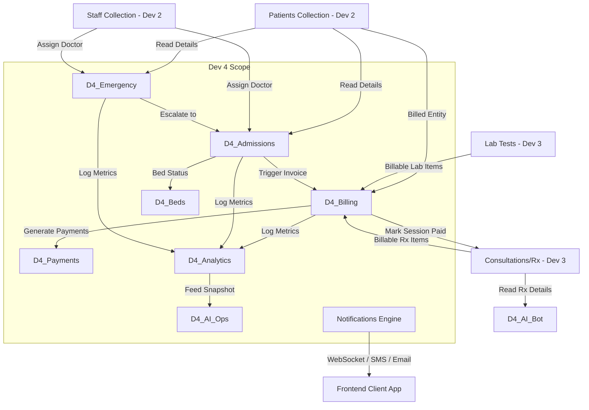
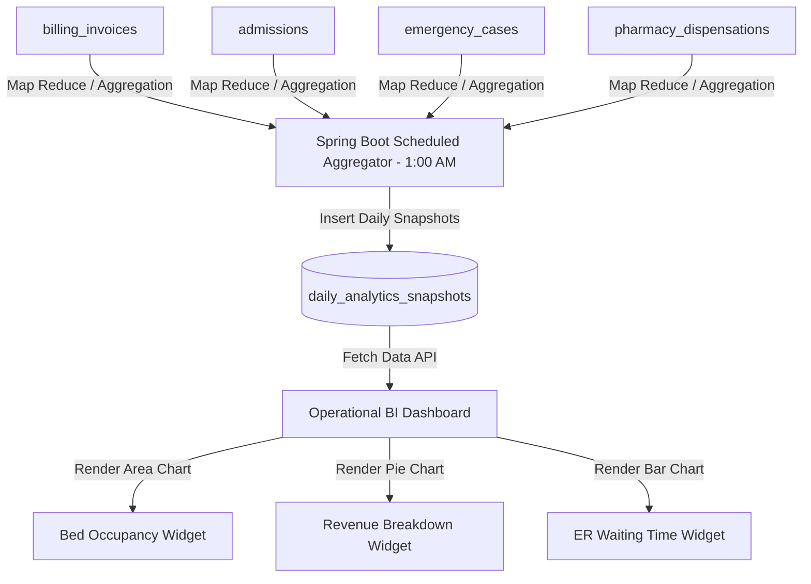

# Developer 4 Detailed Implementation Plan
## Assigned Modules: Billing & Payments, Inpatient Admissions, Emergency, Notifications, Reports & AI Engines

This document serves as the technical implementation plan for Developer 4. It integrates with the database design, API standards, and UI architecture guidelines to define the step-by-step execution path for the assigned scope.

---

## 1. Module Ownership Overview

Developer 4 owns the financial, inpatient operations, urgent care, alert routing, analytical, and operational AI systems.

### Scope Inclusions:
*   **Billing & Payments**: Invoicing, payment ledger records, integration with transaction webhooks, and insurance claims filing.
*   **Inpatient Admission Management**: Ward/room/bed catalogs, live patient allocations, clinical rounds logging, and discharge clearances.
*   **Emergency Management**: Live trauma cases intake, priority triage queue processing, treatment logging, and critical escalations.
*   **Notifications System**: Event-driven alert publisher, managing in-app notifications (WebSockets), SMS (Twilio), and Email (SMTP) delivery.
*   **Reports & Analytics**: Daily aggregation cron jobs, database snapshot compilations, and business intelligence (BI) dashboards.
*   **AI Feature 1 (Prescription Explainer)**: A patient-facing chatbot that explains clinical prescriptions and dosage rules in plain language.
*   **AI Feature 2 (Operations Dashboard)**: An administrative analytics agent that detects operational bottlenecks and generates recommendations.

### Scope Exclusions:
*   Outpatient Consultation notes intake (Owned by Developer 3).
*   Pharmacy Stock catalog adjustments (Owned by Developer 3).
*   User registration and BCrypt password encryption (Owned by Developer 1).
*   Patient demographic master files (Owned by Developer 2).

---

## 2. Dependency Analysis & Integration Points

Developer 4's modules act as downstream consumers of patient clinical data and upstream publishers of financial and system alert events.



### A. Consumed Collections & APIs
*   **Patients (`patients`)**: Fetched during Billing (for insurance coverage matching), Admissions (for identity verification), and Emergency (to link known records).
*   **Staff (`staff`)**: Queried to match admitting doctors to wards and assign emergency physicians to high-priority cases.
*   **Consultations (`consultations`)**: Read to parse medications for the AI Prescription Bot and extract doctor consultation fees.
*   **Lab Tests (`lab_tests`)**: Scanned to pull finished diagnostic tests for itemized patient billing.

### B. Exposed APIs & Services
*   **Notification Publisher Service**: A system-wide Spring component (`NotificationService.sendNotification(...)`) exposed to all developers to trigger instant alerts.
*   **Emergency Trigger to Inpatient Transition**: A service endpoint that shifts stabilized emergency cases to active admissions, automatically claiming a bed.

---

## 3. MongoDB Design Mapping

This section outlines the fields, relationships, and indexes for the collections owned by Developer 4.

### Collection 1: `billing_invoices` (Invoices)
*   **Purpose**: Manages itemized invoices for hospital consultations, lab tests, pharmacy orders, and inpatient admissions.
*   **Relationships**: References `patients` (1:1), references consultations or admissions (1:1). Contains embedded `lineItems` and `insuranceClaim` documents.
*   **Indexes**:
    *   `{"invoiceId": 1}`: Unique.
    *   `{"patientId": 1, "paymentStatus": 1}`: Compound index for retrieving unpaid bills.
    *   `{"dueDate": 1}`: Simple index for cron jobs monitoring payment deadlines.

```json
{
  "_id": {"$oid": "60b8d29a1f28b4382c8f8e0c"},
  "invoiceId": "INV-2026-1029",
  "patientId": {"$oid": "60b8d29a1f28b4382c8f8e04"},
  "encounterRefId": {"$oid": "60b8d29a1f28b4382c8f8e06"},
  "encounterType": "CONSULTATION",
  "invoiceDate": {"$date": "2026-06-12T11:45:00Z"},
  "dueDate": {"$date": "2026-07-12T11:45:00Z"},
  "lineItems": [
    {
      "description": "Consultation Fee",
      "quantity": 1,
      "unitPrice": 50.00,
      "discount": 0.00,
      "tax": 5.00,
      "total": 55.00
    }
  ],
  "subTotal": 50.00,
  "taxTotal": 5.00,
  "discountTotal": 0.00,
  "grandTotal": 55.00,
  "paidAmount": 0.00,
  "outstandingAmount": 55.00,
  "paymentStatus": "UNPAID",
  "insuranceClaim": null,
  "createdAt": {"$date": "2026-06-12T11:45:00Z"},
  "updatedAt": {"$date": "2026-06-12T11:45:00Z"}
}
```

### Collection 2: `billing_payments` (Payments)
*   **Purpose**: Records individual transaction ledger entries for invoices (supports partial payments).
*   **Relationships**: References `billing_invoices` (N:1).
*   **Indexes**:
    *   `{"transactionId": 1}`: Unique.
    *   `{"invoiceId": 1}`: Index for fetching payment histories.

### Collection 3: `admissions` (Inpatient Admissions)
*   **Purpose**: Manages inpatient admissions, tracking ward locations, daily rounds logs, and discharge summaries.
*   **Relationships**: References `patients` (1:1), references `staff` (admitting physician). Contains embedded `dailyRounds` and `dischargeSummary`.
*   **Indexes**:
    *   `{"admissionId": 1}`: Unique.
    *   `{"patientId": 1, "status": 1}`: Compound index for active admission lookups.
    *   `{"status": 1, "wardType": 1}`: Compound index for occupancy reports.

### Collection 4: `beds` (Room & Bed Directory)
*   **Purpose**: Tracks physical bed availability, configurations, and active patient occupancy.
*   **Relationships**: References `patients` (1:1, nullable if empty), references `admissions` (1:1, nullable if empty).
*   **Indexes**:
    *   `{"wardName": 1, "roomNumber": 1, "bedNumber": 1}`: Unique Compound.
    *   `{"occupied": 1}`: Index for occupancy filtering.

```json
{
  "_id": {"$oid": "60b8d29a1f28b4382c8f8e91"},
  "wardName": "ICU-South",
  "roomNumber": "202",
  "bedNumber": "A",
  "bedType": "INTENSIVE_CARE",
  "occupied": true,
  "currentPatientId": {"$oid": "60b8d29a1f28b4382c8f8e04"},
  "currentAdmissionId": {"$oid": "60b8d29a1f28b4382c8f8e0d"},
  "hourlyRate": 120.00
}
```

### Collection 5: `emergency_cases` (Emergency Cases)
*   **Purpose**: Manages live emergency arrivals, triage priority classifications, and clinical treatments.
*   **Relationships**: References `patients` (1:1, nullable if patient is unidentified). References `staff` (assigned ER doctor).
*   **Indexes**:
    *   `{"emergencyId": 1}`: Unique.
    *   `{"status": 1, "triageLevel": 1}`: Compound index for priority queues.
    *   `{"currentLocation": "2dsphere"}`: Geospatial index for incoming ambulances.

### Collection 6: `notifications` (System Alerts Engine)
*   **Purpose**: Queues and tracks system-wide notifications (in-app, SMS, email).
*   **Relationships**: References `users` (recipient).
*   **Indexes**:
    *   `{"recipientUserId": 1, "readStatus": 1}`: Compound index for user inboxes.
    *   `{"createdAt": 1}`: TTL Index configured to automatically purge records after 30 days (`expireAfterSeconds = 2592000`).

### Collection 7: `daily_analytics_snapshots` (Analytics Snapshots)
*   **Purpose**: Records aggregated nightly snapshots of hospital operations.
*   **Relationships**: Denormalized flat documents.
*   **Indexes**:
    *   `{"date": 1}`: Unique index.

### Collection 8: `operational_insights` (AI Operational Insights)
*   **Purpose**: Logs AI-generated recommendations, bottleneck detections, and user action outcomes.
*   **Relationships**: References `daily_analytics_snapshots` (optional link).
*   **Indexes**:
    *   `{"createdAt": 1}`: TTL Index set to purge logs after 90 days.

---

## 4. Frontend UI/UX Plan (React & Tailwind CSS)

### A. Billing & Payments Module
*   **Pages**:
    *   `InvoiceDashboard` (`/billing/invoices`): Main billing ledger. Contains pagination controls, status filters, and search inputs.
    *   `InvoiceDetail` (`/billing/invoices/:id`): Itemized invoice display featuring an printable layout, insurance details, and transaction logs.
*   **Components & Forms**:
    *   `InvoiceTable`: Table showing invoices with status-colored badges (`bg-emerald-100 text-emerald-800` for Paid, `bg-rose-100 text-rose-800` for Unpaid).
    *   `PaymentForm`: Stripe/Razorpay credit card integration modal.
    *   `InsuranceClaimModal`: Form for submitting group numbers, policies, and supporting documents.
*   **User Flow**:
    1. Billing executive opens `/billing/invoices`, filters by "UNPAID", and clicks on a target invoice row.
    2. Reviewing details, the executive clicks "File Insurance Claim" to query the payer API.
    3. If rejected, they process a card payment via the `PaymentForm` to clear the outstanding balance.

### B. Inpatient Admission Module
*   **Pages**:
    *   `WardMonitor` (`/admissions`): Dashboard displaying live ward occupancy rates.
    *   `AdmissionFile` (`/admissions/:id`): Inpatient timeline showing rounds history, active medication lists, and bed allocation cards.
*   **Components & Forms**:
    *   `BedGridSelector`: Interactive ward layout showing color-coded beds (green for free, red for occupied).
    *   `RoundsLoggerForm`: Form for entering vitals and notes during ward rounds.
    *   `DischargeModal`: Discharge checklist modal with direct links to the final billing summary.
*   **User Flow**:
    1. Nurse views `/admissions` and registers a patient by clicking "Admit Patient".
    2. They select an available bed from the `BedGridSelector` to update its state.
    3. During daily rounds, doctors submit clinical notes using the `RoundsLoggerForm`.

### C. Emergency Module
*   **Pages**:
    *   `ERTriageBoard` (`/emergency/triage`): Kanban board organizing cases by triage level (Red, Orange, Yellow).
    *   `ERCaseWorkspace` (`/emergency/case/:id`): Live trauma page for logging treatments and staff assignments.
*   **Components & Forms**:
    *   `TraumaIntakeForm`: Quick intake form (vitals, symptoms, description). Features an AI assist button that returns a suggested triage level.
    *   `TreatmentTimeline`: Timeline display showing administered medicines and emergency procedures.
*   **User Flow**:
    1. Ambulance team registers an incoming case using the `TraumaIntakeForm`.
    2. The case appears on the `ERTriageBoard` with a flashing card colored based on its priority (Red flashing cards go to the top).
    3. The ER Doctor updates the case status, administers treatments, and clicks "Admit to Ward" to transition the patient to the inpatient module.

### D. Notifications Module
*   **Pages**:
    *   `NotificationCenter` (`/notifications`): Inbox page displaying notifications grouped by category.
*   **Components**:
    *   `NotificationBell`: Navbar dropdown widget showing unread notifications.
    *   `AlertToast`: Floating toast alert that slides in when a high-priority notification is received via WebSockets.
*   **User Flow**:
    1. A patient's lab report returns a critical value.
    2. A floating `AlertToast` appears on the assigned doctor's screen.
    3. Clicking the toast opens the notification center, highlighting the critical lab test record.

### E. Reports & Analytics Module
*   **Pages**:
    *   `ReportsDashboard` (`/reports`): Interactive operational analytics dashboard.
*   **Components**:
    *   `OccupancyChart`: Recharts stacked area chart showing inpatient bed occupancy over time.
    *   `RevenueBreakdownChart`: Recharts pie chart displaying revenue by department.
    *   `ERRushHourChart`: Recharts bar chart showing emergency arrivals by hour.
*   **User Flow**:
    1. Hospital admin opens `/reports` to analyze occupancy levels.
    2. They filter charts by date ranges to identify bottleneck trends.

---

## 5. Backend Implementation Plan (Spring Boot & Spring Data)

```
[REST Controller] --> [DTO] --> [Validation] --> [Service Layer] --> [Repository] --> [MongoDB]
```

### A. Core Architecture Configuration
We implement a shared repository architecture utilizing Spring Data MongoDB. Transactions spanning multiple writes (e.g., admitting a patient and marking a bed occupied) are managed using Spring's `@Transactional` annotation.

### B. Business Logic & Controllers Details

#### 1. Billing & Payments Services
*   **Entity**: `BillingInvoice.java`
*   **Repository**: `BillingInvoiceRepository.java` (inherits `MongoRepository<BillingInvoice, ObjectId>`).
*   **Logic**:
    *   `generateInvoice`: Calculates costs based on consultations, lab tests, and room rates, checking patient insurance details.
    *   `applyPayment`: Validates payment amounts, updates `outstandingAmount`, and updates the status to `PAID` if the balance is cleared.
*   **Controller**: `BillingController.java` (`@RestController` mapped to `/api/v1/billing`).

#### 2. Admission Services
*   **Entity**: `Admission.java`, `Bed.java`
*   **Logic**:
    *   `admitInpatient`: Checks bed occupancy state. If free, creates an `Admission` record and sets the target bed's `occupied` flag to `true`.
    *   `dischargeInpatient`: Sets the bed's `occupied` flag to `false`, records the discharge summary, and triggers a billing event to generate the final inpatient invoice.
*   **Controller**: `AdmissionController.java` (`/api/v1/admissions`).

#### 3. Emergency Services
*   **Entity**: `EmergencyCase.java`
*   **Logic**:
    *   `processIntake`: Registers cases, assigns temporary identifiers if unknown, and calls the AI service to suggest a triage level.
    *   `escalateToAdmissions`: Resolves the patient's identity (if previously unknown), closes the ER case, and creates a pending admission record.
*   **Controller**: `EmergencyController.java` (`/api/v1/emergency-cases`).

#### 4. Notifications Services
*   **Entity**: `Notification.java`
*   **Logic**:
    *   `sendNotification`: Dispatches notifications. Delivers messages to active WebSockets, queues emails via Spring Mail (`JavaMailSender`), and sends SMS messages via Twilio.
*   **Controller**: `NotificationController.java` (`/api/v1/notifications`).

#### 5. Reports Services
*   **Logic**:
    *   `nightlyAggregationJob`: Scheduled cron job (`@Scheduled(cron = "0 0 1 * * ?")`) that aggregates database stats and saves a summary to `daily_analytics_snapshots`.
*   **Controller**: `ReportsController.java` (`/api/v1/reports`).

---

## 6. API Implementation Plan

All API endpoints must conform to the defined API Standards (using path versioning, JWT auth, and standard response envelopes).

| Method | Endpoint | Allowed Roles | Request Body / Query Params | Response Data | Validations |
| :--- | :--- | :--- | :--- | :--- | :--- |
| `GET` | `/api/v1/billing/invoices` | `BILLING_EXECUTIVE`, `ADMIN` | `page`, `size`, `status` | Paginated Invoice List | Max size: 100 |
| `POST` | `/api/v1/billing/invoices` | `ADMIN` | CreateInvoiceDTO | Invoice Details | `@NotNull` patientId |
| `POST` | `/api/v1/billing/invoices/{id}/payments` | `BILLING_EXECUTIVE`, `PATIENT` | PaymentDTO | Payment Status | Card token validation |
| `POST` | `/api/v1/admissions` | `DOCTOR`, `NURSE`, `ADMIN` | AdmitPatientDTO | Admission Details | Check bed availability |
| `POST` | `/api/v1/admissions/{id}/rounds` | `DOCTOR` | RecordRoundDTO | Updated Round Details | `@NotBlank` notes |
| `POST` | `/api/v1/admissions/{id}/discharge` | `DOCTOR` | DischargeDTO | Discharge Summary | Check unpaid invoices |
| `POST` | `/api/v1/emergency-cases` | `NURSE`, `DOCTOR` | ERIntakeDTO | ER Case details & AI Score | Triage level validation |
| `GET` | `/api/v1/emergency-cases/active` | `NURSE`, `DOCTOR` | - | Priority Queue List | Sorted by triage score |
| `GET` | `/api/v1/notifications` | All Roles | - | Unread Alerts | Token identity extraction |
| `GET` | `/api/v1/reports/occupancy` | `ADMIN` | `startDate`, `endDate` | Daily Occupancy Array | Valid date range |

---

## 7. Billing & Payments Workflow

```
[Encounter Closed] 
   --> 1. Generate Invoice (Draft) 
   --> 2. Apply Insurance Claims (Verify Policy)
   --> 3. Calculate Patient Outstanding Balance
   --> 4. Client Payment Processing (Stripe Token)
   --> 5. Process Payment Callback & Update Status (PAID)
   --> 6. Generate PDF Receipt & Dispatch Notification
```

### Process Flow Details:
1.  **Generation**: When a consultation or admission is closed, the system queries clinical records to compile room hours, tests performed, and pharmacy dispensations. An invoice document is created in `billing_invoices` with `paymentStatus = "UNPAID"`.
2.  **Claim Filing**: If the patient has insurance, the system submits a claim to the insurance company. If approved, the invoice's `outstandingAmount` is adjusted, and the claim status is marked as `APPROVED`.
3.  **Payment Collection**: The patient paying outstanding balances calls the backend with a Stripe token.
4.  **Confirmation & Hook**: The payment service processes the charge. Once confirmed, it:
    *   Creates a transaction record in the `billing_payments` collection.
    *   Updates the invoice's `paidAmount` and checks if `outstandingAmount == 0`. If so, sets `paymentStatus = "PAID"`.
    *   Triggers an event to generate a PDF receipt.
    *   Sends a payment receipt notification to the patient.

### Edge Case Handling:
*   **Partial Payment**: If the patient pays less than the outstanding balance, the invoice status is set to `PARTIALLY_PAID`, and a partial payment ledger entry is added to `billing_payments`.
*   **Insurance Rejection**: If a claim is rejected, the system reverts the claims balance back to the patient's outstanding responsibility and dispatches an invoice update notification.

---

## 8. Inpatient Admission Workflow

```
[Admission Requested]
   --> Check Bed Availability (beds collection query)
   --> Allocate Room/Bed (set occupied = true, link patientId)
   --> Log Daily Rounds (log notes, vitals, prescriptions)
   --> Discharging Patient (finalize notes, check pending bills)
   --> Free Bed (set occupied = false, unlink patientId)
   --> Trigger Billing Event (compile inpatient invoice)
```

### Room & Bed Management Rules:
*   Beds are organized by ward type (ICU, General, Pediatric, Private).
*   Beds are queried by availability status: `{"occupied": false, "wardType": "ICU"}`.
*   Bed allocations are atomic operations. We update the bed status using a conditional query to prevent concurrent booking conflicts:
    ```javascript
    db.beds.updateOne(
      { _id: bedId, occupied: false },
      { $set: { occupied: true, currentPatientId: patientId, currentAdmissionId: admissionId } }
    )
    ```
*   If the update returns `modifiedCount == 0`, the allocation fails, and the system prompts the user to select another bed.

---

## 9. Emergency Workflow

```
[Ambulance / Walk-In Triage]
   --> 1. Register Case (Save minimal details to emergency_cases)
   --> 2. AI Triage Score Evaluation (Assign Triage Color)
   --> 3. Place Case in Priority Queue (Sort by Triage Score)
   --> 4. Assign On-Duty Staff (Notify Doctor via Push Alert)
   --> 5. Record Treatments & Vitals
   --> 6. Escalation Check (Stable -> Discharge, Critical -> Transfer to ICU)
```

### Escalation Logic:
*   Cases are sorted on the ER dashboard by triage level (`RED` > `ORANGE` > `YELLOW` > `GREEN`).
*   If a case remains in the `ORANGE` status queue for more than 15 minutes without treatment, the notification system triggers an escalation alert to the on-duty ER clinical lead.

---

## 10. Notifications Workflow

We use a Pub-Sub architecture to decouple event triggers from delivery channels.

```
[Clinical/Payment Event]
   --> Publish Event (Spring Event Bus)
   --> Notification Handler (Determine target users and channels)
   --> Dispatch Messages:
       |--> WebSocket (In-App notification banner)
       |--> Twilio API (SMS text alerts)
       |--> SMTP Server (Email notifications)
   --> Log Delivery Status (notifications collection)
```

*   **Triggers**:
    *   `BILLING_DUE`: Outstanding invoice balance notification sent to patient.
    *   `CRITICAL_LAB_ANOMALY`: Lab test alerts sent to assigned doctors.
    *   `ER_QUEUE_DELAY`: Critical case delays escalated to ER Leads.
    *   `ADMISSION_DISCHARGE`: Discharge clearance confirmation sent to patients and nurses.
*   **Retry Mechanism**:
    *   If delivery fails (e.g. SMTP timeout or Twilio rate limit), the notification status is set to `FAILED`. A scheduled background runner picks up failed notifications and retries delivery up to 3 times using an exponential backoff strategy (1m, 5m, 15m) before marking the alert as dead.

---

## 11. Reports & Analytics Workflow

Nightly aggregation routines compile database stats into snapshots to support real-time dashboards.



### Dashboard Core Metrics & Visualizations:
*   **Operational Dashboard**: Aggregates total active admissions, inpatient counts, and average emergency room waiting times.
*   **Revenue Dashboard**: Stacked bar chart showing pharmacy, laboratory, and ward room sales.
*   **Bed Occupancy Dashboard**: Gauges showing active bed capacity by ward.

---

## 12. AI Feature 1: AI Prescription Explanation Bot

This feature provides patients with an interactive chatbot to help them understand their prescriptions and dosage rules.

```
[Patient UI Chat] 
   --> Send Message (Context: patientId, prescriptionDetails)
   --> AI Proxy Controller (Validate user session & apply rate limits)
   --> Call Gemini API (Apply clinical system prompts)
   --> Stream Response (Send tokens back to patient)
```

### A. System Prompt Strategy
The system prompt restricts the model to only explaining the provided prescription details and prevents it from prescribing new medications:

```
You are CareFlow AI, a clinical pharmacologist. Your task is to explain the provided prescription details in plain language to the patient.

Prescription Details:
{prescriptionDetails}

Safety Rules:
1. Explain dosages, medication schedules, food instructions, and possible side effects.
2. Under no circumstances should you recommend or prescribe new medications.
3. If the patient asks for alternative treatments or complains of severe symptoms, instruct them to contact their primary care physician immediately.
4. Keep explanations clear, structured, and easy to understand for laypeople.
```

### B. Security & Rate Limiting
*   **Context Validation**: The service verifies that the patient's JWT user ID matches the patient ID linked to the target consultation prescription.
*   **Rate Limiting**: Calls are limited to `5 requests/minute` per patient token using a token bucket filter to prevent abuse and manage API costs.

---

## 13. AI Feature 2: AI Operations Dashboard

An administrative analytics agent that detects operational bottlenecks and generates recommendations.

```
[Scheduled Cron] 
   --> 1. Query daily_analytics_snapshots (Extract recent operational trends)
   --> 2. Format Prompt (Compile data inputs)
   --> 3. Call Gemini API (Generate operational insights)
   --> 4. Save Insights (Write recommendations to operational_insights)
   --> 5. Admin Panel Load (Display insights on dashboard)
```

### A. Operational Analytics Prompt Design
```
You are an Enterprise Healthcare Operations Analyst. Analyze the following operational snapshot data and identify bottlenecks, occupancy risks, and resource misallocations.

Data Input:
{analyticsSnapshot}

Tasks:
1. Calculate the projected ICU capacity risk for the next 48 hours.
2. Identify pharmacy stock items at risk of running out.
3. Highlight peak emergency room arrival periods and suggest staff scheduling updates.
4. Provide 3 actionable recommendations to improve operational efficiency.
```

### B. Actionable Recommendations Format
Insights are saved to the `operational_insights` collection using the following format:
```json
{
  "_id": {"$oid": "60b8d29a1f28b4382c8f8e71"},
  "insightType": "CAPACITY_WARNING",
  "severity": "HIGH",
  "description": "ICU occupancy rate has reached 94%. Projected arrivals suggest capacity limit will be exceeded within 24 hours.",
  "actionableSteps": [
    "Initiate discharge clearances for patients in recovery.",
    "Redirect non-emergency surgical admissions to semi-private rooms.",
    "Put on-call ICU nursing staff on active standby."
  ],
  "createdAt": {"$date": "2026-06-13T00:00:00Z"}
}
```

---

## 14. Target Folder Structure

This section outlines the target folder structure for Developer 4's modules (Billing, Admissions, Emergency, Notifications, Reports, and AI features).

### A. Frontend React Modules
```
src/
└── features/
    ├── billing/
    │   ├── components/
    │   │   ├── InvoiceTable.jsx
    │   │   ├── PaymentForm.jsx
    │   │   └── InsuranceClaimModal.jsx
    │   ├── pages/
    │   │   ├── InvoiceDashboard.jsx
    │   │   └── InvoiceDetail.jsx
    │   └── services/
    │       └── billingApi.js
    ├── admission/
    │   ├── components/
    │   │   ├── BedGridSelector.jsx
    │   │   ├── RoundsLoggerForm.jsx
    │   │   └── DischargeModal.jsx
    │   └── pages/
    │       ├── WardMonitor.jsx
    │       └── AdmissionFile.jsx
    ├── emergency/
    │   ├── components/
    │   │   ├── TriageBoard.jsx
    │   │   ├── TraumaIntakeForm.jsx
    │   │   └── ERTreatmentLogger.jsx
    │   └── pages/
    │       └── ERTriageBoard.jsx
    ├── notifications/
    │   ├── components/
    │   │   ├── NotificationBell.jsx
    │   │   └── AlertToast.jsx
    │   └── pages/
    │       └── NotificationCenter.jsx
    └── reports/
        ├── components/
        │   ├── OccupancyChart.jsx
        │   ├── RevenueBreakdownChart.jsx
        │   └── AIModelMetricsCard.jsx
        └── pages/
            └── ReportsDashboard.jsx
```

### B. Backend Spring Boot Package Structure
```
com.hms.backend/
├── features/
│   ├── billing/
│   │   ├── controller/
│   │   │   └── BillingController.java
│   │   ├── dto/
│   │   │   ├── CreateInvoiceDTO.java
│   │   │   └── PaymentDTO.java
│   │   ├── entity/
│   │   │   ├── BillingInvoice.java
│   │   │   └── BillingPayment.java
│   │   ├── repository/
│   │   │   ├── BillingInvoiceRepository.java
│   │   │   └── BillingPaymentRepository.java
│   │   └── service/
│   │       └── BillingService.java
│   ├── admission/
│   │   ├── controller/
│   │   │   └── AdmissionController.java
│   │   ├── entity/
│   │   │   ├── Admission.java
│   │   │   └── Bed.java
│   │   ├── repository/
│   │   │   ├── AdmissionRepository.java
│   │   │   └── BedRepository.java
│   │   └── service/
│   │       └── AdmissionService.java
│   ├── emergency/
│   │   ├── controller/
│   │   │   └── EmergencyController.java
│   │   ├── entity/
│   │   │   └── EmergencyCase.java
│   │   ├── repository/
│   │   │   └── EmergencyCaseRepository.java
│   │   └── service/
│   │       └── EmergencyService.java
│   ├── notifications/
│   │   ├── controller/
│   │   │   └── NotificationController.java
│   │   ├── entity/
│   │   │   └── Notification.java
│   │   ├── repository/
│   │   │   └── NotificationRepository.java
│   │   └── service/
│   │       ├── NotificationService.java
│   │       └── WebSocketService.java
│   ├── reports/
│   │   ├── controller/
│   │   │   └── ReportsController.java
│   │   ├── entity/
│   │   │   └── DailyAnalyticsSnapshot.java
│   │   ├── repository/
│   │   │   └── DailyAnalyticsSnapshotRepository.java
│   │   └── service/
│   │       ├── ReportsService.java
│   │       └── NightlyAnalyticsScheduler.java
│   └── ai/
│       ├── controller/
│       │   └── AIController.java
│       ├── entity/
│       │   └── OperationalInsight.java
│       ├── repository/
│       │   └── OperationalInsightRepository.java
│       └── service/
│           ├── GeminiService.java
│           └── AIOperationsService.java
```

---

## 15. Development Sequence

We will implement the modules in the following order:

```
[Phase 1: Foundations] Beds & Notifications Collections Setup
   --> [Phase 2: Core Workflows] Admissions, Emergency, and Billing
   --> [Phase 3: Integrations] Webhook Payment Processes
   --> [Phase 4: Analytics] Aggregation Pipelines & Dashboards
   --> [Phase 5: AI Engines] Gemini Chat & Recommendations Integration
```

### Phase 1: Beds & Notifications Foundations
1.  Setup MongoDB collections and indexes for `beds` and `notifications`.
2.  Build the bed repository and notification listener services.
3.  Implement the WebSocket alert router.

### Phase 2: Inpatient Admissions & ER Workflows
1.  Implement the bed selection logic and add room occupancy validations.
2.  Build the emergency registration controller and triage priority queue logic.
3.  Integrate the emergency-to-inpatient bed allocation flow.

### Phase 3: Billing & Webhook Payments
1.  Build the invoice generation service, incorporating cost calculations for consultations and rooms.
2.  Implement the payment processing APIs and card validation hooks.
3.  Add support for partial payments and insurance claims handling.

### Phase 4: Reports Aggregation
1.  Implement scheduled cron jobs to compile statistics.
2.  Build the reports endpoints and connect Recharts analytics widgets on the frontend.

### Phase 5: AI Chatbots & Recommendation Engines
1.  Integrate the Gemini API client.
2.  Implement the prescription explanation bot and add rate-limiting filters.
3.  Implement the AI operations recommendation engine.

---

## 16. Testing Plan

### A. Unit Tests
*   `AdmissionServiceTest`: Verifies that double-allocating a bed throws an `IllegalStateException`.
*   `BillingInvoiceTest`: Verifies that payments update outstanding balances and invoice statuses correctly.
*   `TriageEngineTest`: Verifies that emergency triage classification logic matches expected parameters.

### B. Integration Tests
*   `BedAllocationConcurrencyTest`: Simulates multiple concurrent requests attempting to book the same bed, verifying that only one booking succeeds.
*   `PaymentWebhookTest`: Simulates Stripe callback requests, verifying that invoices are updated correctly.

### C. API Tests (MockMvc)
*   `POST /api/v1/admissions`: Verifies validations and role requirements.
*   `POST /api/v1/emergency-cases`: Verifies error responses for invalid triage request DTOs.

### D. Frontend Tests (React Testing Library)
*   `BedGridSelector`: Verifies bed state color-coding.
*   `PrescriptionExplainer`: Verifies that chat history is rendered correctly and checks text limits.

### E. AI Feature Tests
*   `AIBotPromptTest`: Verifies that the system prompt is configured correctly.
*   `AIBotRateLimiterTest`: Simulates high-frequency requests to verify rate-limiting actions.

---

## 17. Final Deliverables & Code Merge Checklist

Before merging the branch, verify that all items on the checklist are complete:

*   [ ] The Spring Boot backend compiles and runs without errors.
*   [ ] Database indexes are configured in MongoDB.
*   [ ] API endpoints conform to the defined API standards (using envelope formats and path versioning).
*   [ ] All unit, integration, and API tests pass.
*   [ ] Frontend components are responsive, support mobile layouts, and have been tested.
*   [ ] The Gemini API integration compiles, and API keys are stored in secure environment variables.
*   [ ] Role-based UI components render correctly.
*   [ ] All temporary files and test logs are cleaned up.
