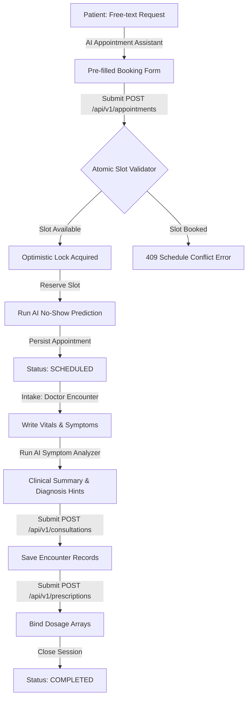

# AI-powered-HMS
# Implementation Plan - AI-Powered HMS (Member 2 Scope)

This document provides a comprehensive technical implementation plan for the **Patient & Doctor Operations (Member 2)** subsystem of the AI-Powered Hospital Management System (HMS). It covers backend service architecture, MongoDB data modeling, security configuration, REST API endpoints, Next.js frontend portal design, and AI service integration.

---

## 1. Project Overview & Scope Alignment

The Member 2 Scope focuses entirely on the operations related to Patients, Doctors, Appointments, Consultations, Prescriptions, and AI integrations. It integrates with standard stateless JWT authentication and enforces role-based and attribute-based access control (RBAC/ABAC).

### Core Operations Flow

---

## 2. User Review Required

> [!IMPORTANT]
> **Optimistic Locking on DoctorSchedules:** To prevent booking race conditions (multiple patients booking the same slot), we will use Spring Data's `@Version` on the `DoctorSchedules` document. Any concurrent updates will throw an `OptimisticLockingFailureException`, which we translate to a `409 Conflict` (ScheduleConflictException).
>
> **AI API Keys Configuration:** The backend will connect to the Gemini API (`gemini-1.5-flash`) using Spring's `WebClient`. In the absence of an API key in the environment, the system will fall back to a deterministic, high-quality local mockup generator to avoid application failure during local testing and development.
>
> **Stateless Security Setup:** The JWT verification is configured to intercept `/api/v1/` requests via a custom `JwtAuthenticationFilter`. We assume the token signature uses a shared HS256 secret.

---

## 3. MongoDB Collection specifications & Database Design

The data modeling leverages MongoDB's document architecture using embedding for bounded relationships (such as vitals and diagnoses) and referencing for unbounded entities (such as appointments and consultations).

| Collection Name | Strategy | Primary Indexes | Secondary Indexes | Key Fields |
| :--- | :--- | :--- | :--- | :--- |
| **patients** | Mixed (Referenced, Embedded History) | `_id` (ObjectId), `patientId` (Unique) | `email` (Unique), `phone` (Sparse), `personalInfo.lastName` | `personalInfo`, `contactInfo`, `emergencyContacts`, `insuranceDetails`, `primaryDoctorId`, `aiHealthProfile` |
| **appointments** | Referenced | `_id` (ObjectId), `appointmentId` (Unique) | `patientId`, `doctorId` + `appointmentDate` | `patientId`, `doctorId`, `appointmentDate`, `appointmentTime`, `status`, `aiNoShowDetails` |
| **doctorSchedules**| Referenced | `_id` (ObjectId) | `doctorId` + `availableDate` (Unique) | `doctorId`, `availableDate`, `timeSlots`, `version` (optimistic lock field) |
| **consultations** | Mixed (Embedded Vitals & Diagnoses) | `_id` (ObjectId), `consultationId` (Unique) | `appointmentId` (Unique), `patientId` | `appointmentId`, `patientId`, `doctorId`, `vitals`, `symptoms`, `diagnoses`, `aiClinicalInsights` |
| **prescriptions** | Referenced | `_id` (ObjectId), `prescriptionId` (Unique) | `consultationId` (Unique) | `consultationId`, `medications` (dosage array) |

---

## 4. Production API Specification Contract

All endpoints use JSON payload wrappers and adhere to RESTful naming conventions.

| Method | HTTP Route | Allowed Roles | Description | Response Status |
| :--- | :--- | :--- | :--- | :--- |
| **POST** | `/api/v1/patients` | `ADMIN`, `PATIENT` | Registers a new patient record | `201 Created` |
| **GET** | `/api/v1/patients` | `ADMIN`, `DOCTOR` | Paginated search of patients (`?page=0&size=10&search=John`) | `200 OK` |
| **GET** | `/api/v1/patients/{id}` | `ADMIN`, `DOCTOR`, `PATIENT` (Owner) | Fetches complete patient profile + medical history | `200 OK` |
| **PUT** | `/api/v1/patients/{id}` | `ADMIN`, `PATIENT` (Owner) | Delta updates to demographic and address details | `200 OK` |
| **DELETE**| `/api/v1/patients/{id}` | `ADMIN` | Soft-deactivates the patient profile | `204 No Content` |
| **POST** | `/api/v1/appointments` | `ADMIN`, `NURSE`, `PATIENT` | Books an appointment slot (atomically checks schedule) | `201 Created` |
| **GET** | `/api/v1/appointments` | `ADMIN`, `DOCTOR`, `PATIENT` | Lists active appointments filtered by caller's role context | `200 OK` |
| **PUT** | `/api/v1/appointments/{id}/status`| `ADMIN`, `DOCTOR`, `NURSE`, `PATIENT` | Transition appointment status pipeline | `200 OK` |
| **POST** | `/api/v1/consultations` | `DOCTOR` | Closes appointment, submits vitals and primary diagnosis | `201 Created` |
| **POST** | `/api/v1/prescriptions` | `DOCTOR` | Binds dosage and administration instructions to a consultation | `201 Created` |

---

## 5. Proposed Code Changes

### Component 1: Domain Models (Java Spring Boot)

- **`backend/src/main/java/com/hms/backend/model/Patient.java`**: Map `patients` collection.
- **`backend/src/main/java/com/hms/backend/model/Appointment.java`**: Map `appointments` collection.
- **`backend/src/main/java/com/hms/backend/model/DoctorSchedule.java`**: Map `doctorSchedules` collection, utilizing `@Version` field.
- **`backend/src/main/java/com/hms/backend/model/Consultation.java`**: Map `consultations` collection.
- **`backend/src/main/java/com/hms/backend/model/Prescription.java`**: Map `prescriptions` collection.

### Component 2: Service & REST Layer

- **`backend/src/main/java/com/hms/backend/service/AiService.java`**: Integrates Gemini API for symptom evaluation and NLP text extraction.
- **`backend/src/main/java/com/hms/backend/security/JwtAuthenticationFilter.java`**: Standard header validation filter.
- **`backend/src/main/java/com/hms/backend/controller/PatientController.java`**: Handles patient profiles CRUD.
- **`backend/src/main/java/com/hms/backend/controller/AppointmentController.java`**: Orchestrates bookings.

### Component 3: Frontend Client (Next.js 16 + React 19)

- **`src/app/page.tsx`**: Renders a landing/portal entry screen allowing users to log in as a Patient, Doctor, or Admin (using mock accounts or connecting to backend).
- **`src/app/dashboard/patient/page.tsx`**: Patient portal for bookings, profile editing, and history view.
- **`src/app/dashboard/doctor/page.tsx`**: Doctor portal for managing intake vitals, executing AI symptom parsing, and prescribing dosage charts.

---

## 6. Verification Plan

### Automated Tests
1. **Spring Boot MockMvc Tests:** Verify input validations (`@Valid`) and security authorization headers (`JwtAuthenticationFilter`).
2. **Service Tests:** Mock repository calls and verify transaction rollbacks and schedule race-condition optimistic locking.
3. **Frontend Component Tests:** Run Next.js builds (`npm run build`) to ensure TypeScript type safety.

### Manual Verification
1. **Concurrent Booking Simulation:** Trigger two parallel requests booking the same time slot for a doctor, ensuring only one succeeds (201 Created) while the other fails with a `409 Conflict`.
2. **End-to-End Walkthrough:** Log in, parse a sentence like *"Book cardiologist checkup next Monday at 10 AM"* via the AI Assistant, submit booking, log in as Doctor, write clinical encounter with AI symptom analysis, prescribe drugs, and close the consultation.
